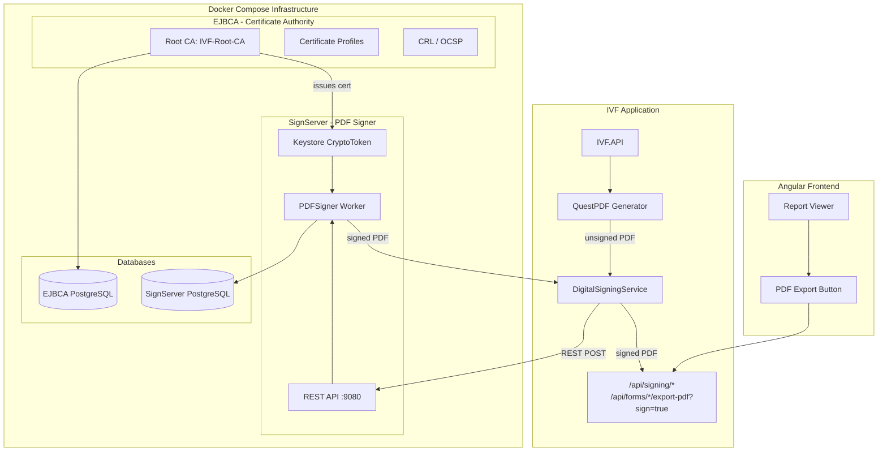
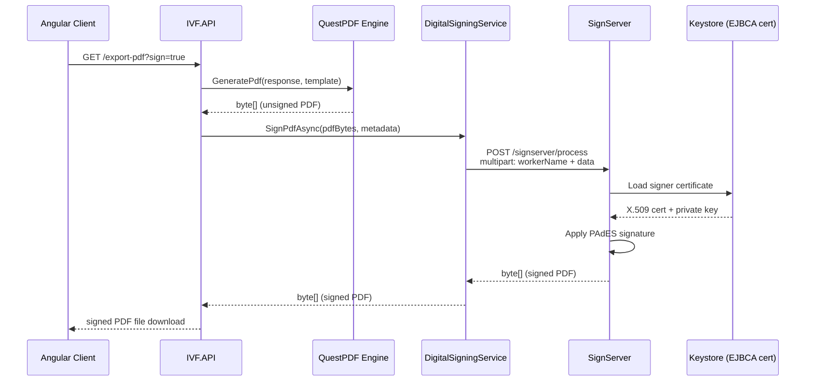
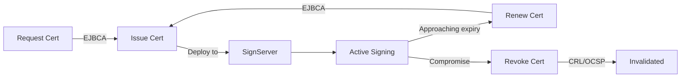

# Hệ Thống Ký Số PDF - EJBCA + SignServer

Tài liệu hướng dẫn triển khai và sử dụng hệ thống ký số PDF cho IVF System, sử dụng **EJBCA** (Certificate Authority) và **SignServer** (Document Signing Service).

---

## Kiến Trúc Tổng Quan



---

## Thành Phần

### 1. EJBCA (Enterprise Java Beans Certificate Authority)

| Thuộc tính     | Giá trị                                               |
| -------------- | ----------------------------------------------------- |
| **Image**      | `keyfactor/ejbca-ce:latest`                           |
| **Container**  | `ivf-ejbca`                                           |
| **Admin UI**   | https://localhost:8443/ejbca/adminweb/                |
| **Public Web** | http://localhost:8442/ejbca/publicweb/                |
| **Database**   | PostgreSQL (`ivf-ejbca-db`, port internal)            |
| **Chức năng**  | Quản lý CA, phát hành/thu hồi chứng thư số, OCSP, CRL |

**Vai trò trong hệ thống:**

- Tạo và quản lý Root CA (`IVF-Root-CA`)
- Phát hành chứng thư số cho SignServer (PDF Signer certificate)
- Quản lý vòng đời chứng thư (renew, revoke)
- Cung cấp OCSP/CRL cho xác minh chữ ký

### 2. SignServer (Document Signing Service)

| Thuộc tính    | Giá trị                                         |
| ------------- | ----------------------------------------------- |
| **Image**     | `keyfactor/signserver-ce:latest`                |
| **Container** | `ivf-signserver`                                |
| **Admin UI**  | https://localhost:9443/signserver/adminweb/     |
| **REST API**  | http://localhost:9080/signserver/process        |
| **Database**  | PostgreSQL (`ivf-signserver-db`, port internal) |
| **Worker**    | `PDFSigner` (Worker ID: 1)                      |

**Vai trò trong hệ thống:**

- Nhận PDF chưa ký từ IVF API qua REST API
- Ký số PDF bằng chứng thư từ EJBCA (PAdES signature)
- Trả về PDF đã ký với chữ ký số nhúng
- Hỗ trợ visible/invisible signature

### 3. IVF API Integration

| Component          | File                                                          |
| ------------------ | ------------------------------------------------------------- |
| **Interface**      | `IVF.Application/Common/Interfaces/IDigitalSigningService.cs` |
| **Implementation** | `IVF.API/Services/SignServerDigitalSigningService.cs`         |
| **Configuration**  | `IVF.API/Services/DigitalSigningOptions.cs`                   |
| **Endpoints**      | `IVF.API/Endpoints/DigitalSigningEndpoints.cs`                |
| **Settings**       | `appsettings.json` → section `DigitalSigning`                 |

---

## Cài Đặt & Triển Khai

### Yêu Cầu

- Docker Desktop (Windows/Mac) hoặc Docker Engine (Linux)
- Docker Compose v2+
- .NET 10 SDK
- ~4GB RAM cho EJBCA + SignServer

### Bước 1: Khởi Chạy Infrastructure

```powershell
# Windows
cd d:\Pr.Net\IVF
.\scripts\setup-signing.ps1

# Linux/Mac
bash scripts/setup-signing.sh
```

Hoặc khởi chạy thủ công:

```powershell
# Chỉ chạy signing services
docker compose up -d ejbca-db signserver-db
Start-Sleep 10
docker compose up -d ejbca
# Đợi EJBCA healthy (~2-3 phút lần đầu)
docker compose up -d signserver

# Chạy toàn bộ infrastructure
docker compose up -d
```

### Bước 2: Cấu Hình EJBCA

1. Truy cập **EJBCA Admin UI**: https://localhost:8443/ejbca/adminweb/
2. Tạo **Certificate Profile** cho PDF Signer:
   - Name: `IVF-PDFSigner-Profile`
   - Key Usage: Digital Signature, Non-Repudiation
   - Extended Key Usage: Email Protection, Document Signing
3. Tạo **End Entity Profile**:
   - Name: `IVF-Signer-EEProfile`
   - Certificate Profile: `IVF-PDFSigner-Profile`
4. **Enroll Certificate** cho SignServer:
   - CN: `IVF PDF Signer`
   - O: `IVF Clinic`
   - C: `VN`
   - Export dạng PKCS12 (.p12)

### Bước 3: Cấu Hình SignServer

1. Truy cập **SignServer Admin UI**: https://localhost:9443/signserver/adminweb/
2. **Tạo PDFSigner Worker**:
   - Worker Name: `PDFSigner`
   - Implementation: `org.signserver.module.pdfsigner.PDFSigner`
   - Crypto Token: P12CryptoToken (PKCS12 keystore, generated with Java keytool)
   - Upload chứng thư từ EJBCA
3. **Activate** crypto token
4. **Test** worker qua Admin UI

### Bước 4: Cấu Hình IVF API

Cập nhật `appsettings.json`:

```json
{
  "DigitalSigning": {
    "Enabled": true,
    "SignServerUrl": "http://localhost:9080/signserver",
    "WorkerName": "PDFSigner",
    "TimeoutSeconds": 30,
    "DefaultReason": "Xác nhận báo cáo y tế IVF",
    "DefaultLocation": "IVF Clinic",
    "DefaultContactInfo": "support@ivf-clinic.vn",
    "EjbcaUrl": "https://localhost:8443/ejbca",
    "SkipTlsValidation": true,
    "AddVisibleSignature": true,
    "VisibleSignaturePage": 0
  }
}
```

Khi chạy trong Docker:

```yaml
# docker-compose.yml (đã cấu hình sẵn)
environment:
  - DigitalSigning__SignServerUrl=http://signserver:8080/signserver
  - DigitalSigning__Enabled=true
```

---

## API Endpoints

### Signing Management

| Method | Endpoint                | Mô tả                              |
| ------ | ----------------------- | ---------------------------------- |
| `GET`  | `/api/signing/health`   | Kiểm tra health SignServer + EJBCA |
| `GET`  | `/api/signing/config`   | Thông tin cấu hình signing         |
| `POST` | `/api/signing/sign-pdf` | Upload & ký số PDF bất kỳ          |

### Form PDF Export (có ký số)

| Method | Endpoint                                         | Mô tả                            |
| ------ | ------------------------------------------------ | -------------------------------- |
| `GET`  | `/api/forms/responses/{id}/export-pdf?sign=true` | Export form response → PDF đã ký |
| `GET`  | `/api/forms/reports/{id}/export-pdf?sign=true`   | Export report → PDF đã ký        |

### Ví Dụ Sử Dụng

#### Kiểm tra health

```powershell
$token = (Invoke-RestMethod -Uri "http://localhost:5000/api/auth/login" `
    -Method POST -ContentType "application/json" `
    -Body '{"username":"admin","password":"Admin@123"}').accessToken

Invoke-RestMethod -Uri "http://localhost:5000/api/signing/health" `
    -Headers @{Authorization="Bearer $token"}
```

Response:

```json
{
  "isHealthy": true,
  "signServerReachable": true,
  "workerConfigured": true,
  "certificateSubject": "CN=IVF PDF Signer,O=IVF Clinic,C=VN",
  "certificateExpiry": "2029-02-11T00:00:00Z"
}
```

#### Export PDF đã ký số

```powershell
# Export form response với ký số
Invoke-RestMethod `
    -Uri "http://localhost:5000/api/forms/responses/{responseId}/export-pdf?sign=true" `
    -Headers @{Authorization="Bearer $token"} `
    -OutFile "signed_report.pdf"

# Export aggregate report với ký số
Invoke-RestMethod `
    -Uri "http://localhost:5000/api/forms/reports/{reportId}/export-pdf?sign=true&from=2026-01-01&to=2026-02-11" `
    -Headers @{Authorization="Bearer $token"} `
    -OutFile "signed_aggregate_report.pdf"
```

#### Upload & ký PDF bất kỳ

```powershell
$form = @{
    file = Get-Item "unsigned.pdf"
    reason = "Xác nhận kết quả xét nghiệm"
    location = "Phòng Lab IVF"
    signerName = "BS. Nguyễn Văn A"
}
Invoke-RestMethod -Uri "http://localhost:5000/api/signing/sign-pdf" `
    -Method POST -Form $form `
    -Headers @{Authorization="Bearer $token"} `
    -OutFile "signed_output.pdf"
```

---

## Luồng Ký Số (Signing Flow)



---

## Cấu Hình Chi Tiết

### SignServer Worker Properties

Worker được cấu hình qua properties file + CLI commands:

```properties
# Properties file (loaded via: signserver setproperties /tmp/worker.properties)
GLOB.WORKER1.CLASSPATH = org.signserver.module.pdfsigner.PDFSigner
GLOB.WORKER1.SIGNERTOKEN.CLASSPATH = org.signserver.server.cryptotokens.P12CryptoToken
WORKER1.NAME = PDFSigner
WORKER1.AUTHTYPE = NOAUTH
WORKER1.DEFAULTKEY = signer
WORKER1.KEYSTOREPATH = /tmp/signer.p12
WORKER1.KEYSTOREPASSWORD = changeit
```

**Lưu ý quan trọng:** Sau khi `setproperties`, cần set TYPE riêng vì có bug reset TYPE thành rỗng:

```bash
signserver setproperty 1 TYPE PROCESSABLE
signserver setproperty 1 CERTIFICATION_LEVEL NOT_CERTIFIED
signserver setproperty 1 ADD_VISIBLE_SIGNATURE false
signserver setproperty 1 REASON "Xac nhan bao cao y te IVF"
signserver setproperty 1 LOCATION "IVF Clinic"
signserver setproperty 1 REFUSE_DOUBLE_INDIRECT_OBJECTS true
signserver reload 1
signserver activatecryptotoken 1 changeit
```

Keystore được tạo bằng Java keytool inside container (đảm bảo tương thích PKCS12 format):

```bash
keytool -genkeypair -alias signer -keyalg RSA -keysize 2048 \
  -sigalg SHA256withRSA -validity 1095 \
  -dname "CN=IVF PDF Signer,O=IVF Clinic,OU=Digital Signing,C=VN" \
  -keystore /tmp/signer.p12 -storetype PKCS12 \
  -storepass changeit -keypass changeit
```

### Docker Compose Ports

| Service       | Container Port | Host Port | Protocol        |
| ------------- | -------------- | --------- | --------------- |
| EJBCA         | 8443           | 8443      | HTTPS (Admin)   |
| EJBCA         | 8080           | 8442      | HTTP (Public)   |
| SignServer    | 8443           | 9443      | HTTPS (Admin)   |
| SignServer    | 8080           | 9080      | HTTP (REST API) |
| EJBCA DB      | 5432           | -         | Internal only   |
| SignServer DB | 5432           | -         | Internal only   |

---

## Bảo Mật

### Development

- TLS validation được skip (`SkipTlsValidation: true`)
- Self-signed certificate được sử dụng
- NOAUTH cho SignServer worker

### Production Checklist

- [ ] Sử dụng EJBCA-issued certificate thay vì self-signed
- [ ] Enable TLS validation (`SkipTlsValidation: false`)
- [ ] Cấu hình mutual TLS giữa IVF API và SignServer
- [ ] Enable authentication cho SignServer worker
- [ ] Cấu hình TSA (Timestamp Authority) cho long-term validation
- [ ] Setup OCSP responder trong EJBCA
- [ ] Rotate certificates trước khi hết hạn
- [ ] Backup EJBCA CA keys
- [ ] Giới hạn network access cho signing services
- [ ] Enable audit logging trong EJBCA & SignServer

### Certificate Lifecycle



---

## Troubleshooting

### EJBCA không khởi động

```powershell
docker compose logs ejbca --tail=100
# Kiểm tra database connectivity
docker exec ivf-ejbca-db pg_isready -U ejbca
```

### SignServer worker không active

```powershell
# Kiểm tra worker status
docker exec ivf-signserver /opt/keyfactor/bin/signserver getstatus brief all
# Reload worker
docker exec ivf-signserver /opt/keyfactor/bin/signserver reload 1
# Check logs
docker compose logs signserver --tail=100
```

### Signing API trả về 502

- Kiểm tra SignServer container đang chạy: `docker ps | findstr signserver`
- Kiểm tra health: `curl http://localhost:9080/signserver/healthcheck/signserverhealth`
- Kiểm tra kết nối từ IVF API: `GET /api/signing/health`

### Certificate hết hạn

1. Truy cập EJBCA Admin → End Entities
2. Renew certificate cho SignServer signer
3. Export PKCS12 mới
4. Upload vào SignServer container
5. Reload worker

---

## Tài Liệu Tham Khảo

- [EJBCA CE Documentation](https://doc.primekey.com/ejbca/)
- [SignServer CE Documentation](https://doc.primekey.com/signserver/)
- [PAdES (PDF Advanced Electronic Signatures)](https://en.wikipedia.org/wiki/PAdES)
- [RFC 5652 - CMS (Cryptographic Message Syntax)](https://tools.ietf.org/html/rfc5652)
- [Docker Compose - EJBCA](https://hub.docker.com/r/keyfactor/ejbca-ce)
- [Docker Compose - SignServer](https://hub.docker.com/r/keyfactor/signserver-ce)
