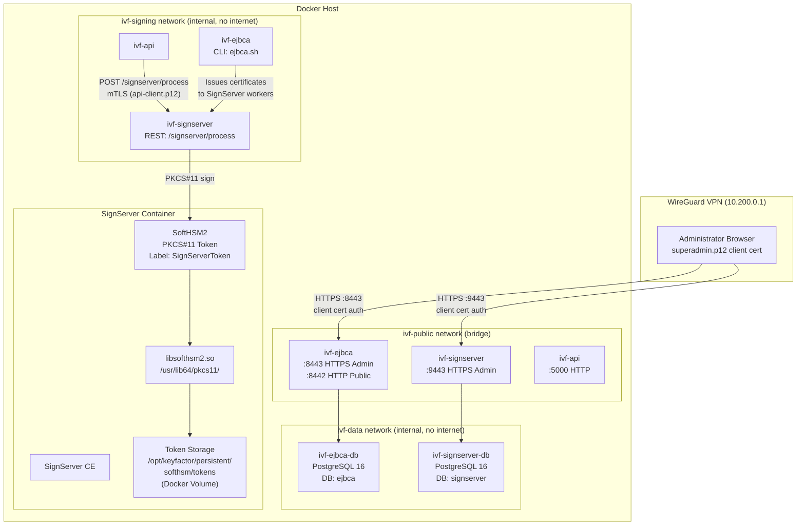
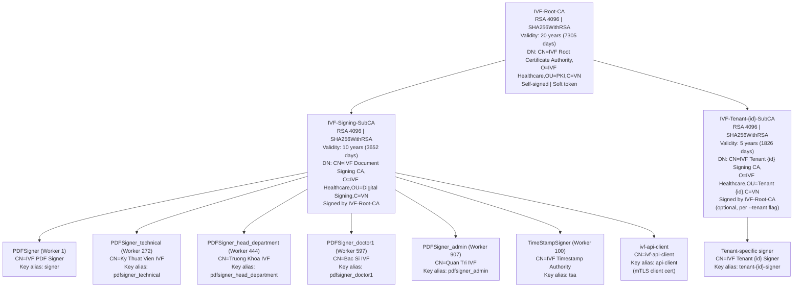
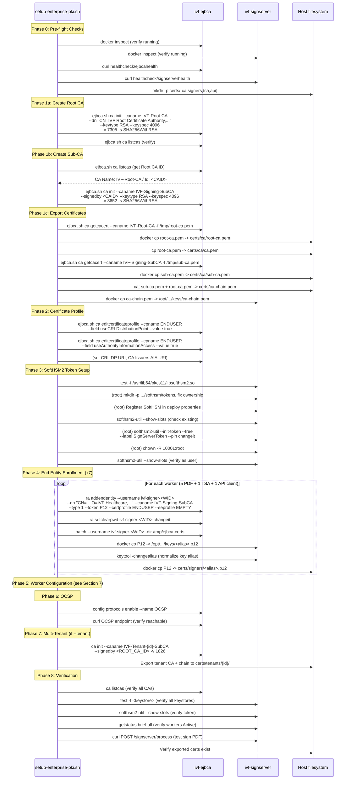
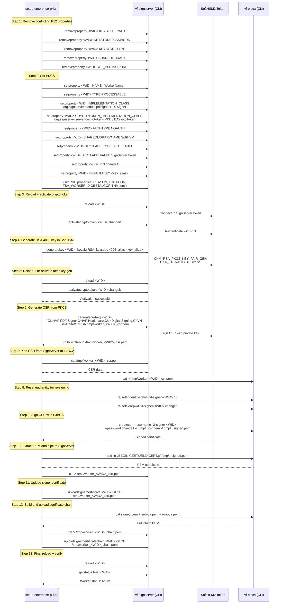
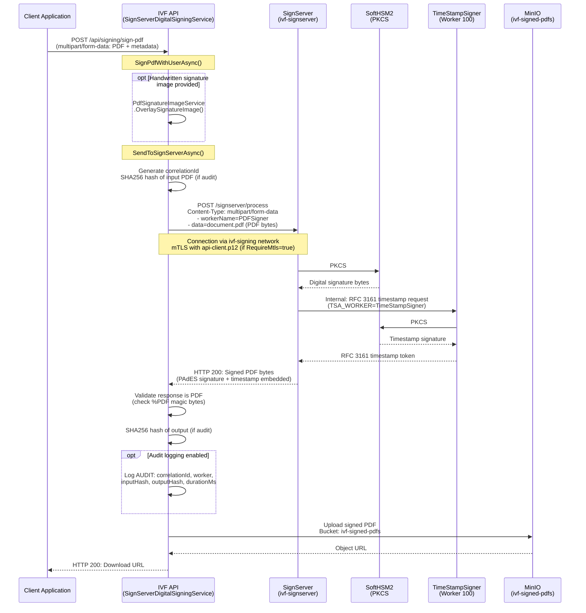
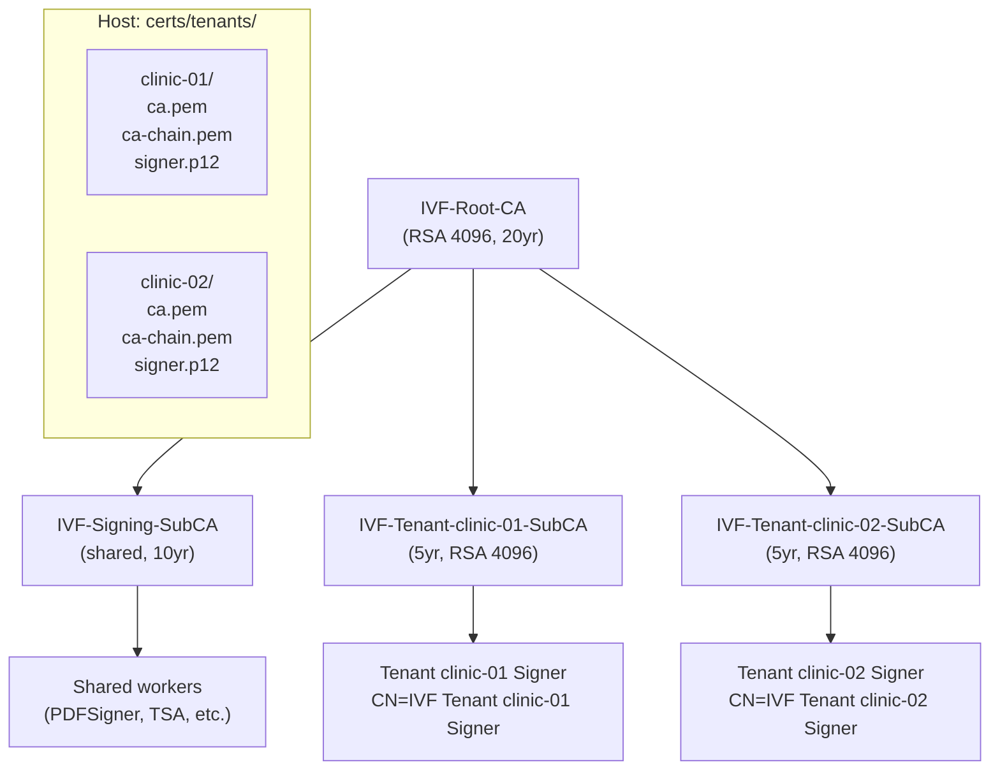
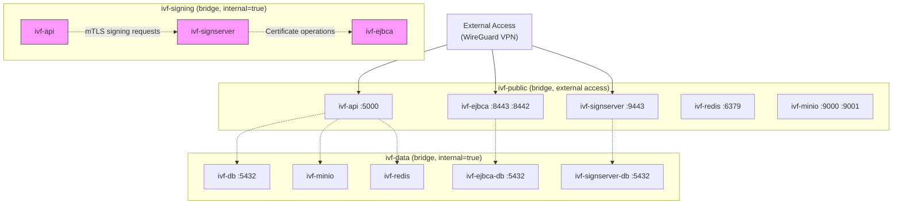

# Enterprise PKI Infrastructure Guide

## Table of Contents

1. [Overview](#1-overview)
2. [Architecture Diagram](#2-architecture-diagram)
3. [CA Hierarchy](#3-ca-hierarchy)
4. [Certificate Profiles](#4-certificate-profiles)
5. [SoftHSM2 PKCS#11 Architecture](#5-softhsm2-pkcs11-architecture)
6. [Complete Setup Flow](#6-complete-setup-flow)
7. [PKCS#11 Worker Configuration Flow](#7-pkcs11-worker-configuration-flow)
8. [PDF Signing Flow](#8-pdf-signing-flow)
9. [Multi-Tenant PKI](#9-multi-tenant-pki)
10. [Docker Compose Services](#10-docker-compose-services)
11. [Network Architecture](#11-network-architecture)
12. [Truststore Configuration](#12-truststore-configuration)
13. [Admin Web UI Access](#13-admin-web-ui-access)
14. [Configuration Reference](#14-configuration-reference)
15. [CLI Reference](#15-cli-reference)
16. [Troubleshooting](#16-troubleshooting)
17. [Security Considerations](#17-security-considerations)
18. [Script Reference](#18-script-reference)
19. [File Inventory](#19-file-inventory)

---

## 1. Overview

The IVF Enterprise PKI system provides a complete public key infrastructure for digitally signing clinical PDF documents (medical reports, prescriptions, consent forms). It is built on open-source components running as Docker containers, orchestrated by a single idempotent setup script.

### Components

| Component | Role | Image |
|---|---|---|
| **EJBCA CE** | Certificate Authority -- issues, manages, and revokes X.509 certificates | `keyfactor/ejbca-ce:latest` |
| **SignServer CE** | Document signing service -- signs PDFs using keys and certificates from EJBCA | `keyfactor/signserver-ce:latest` (or custom SoftHSM build) |
| **SoftHSM2** | Software-based PKCS#11 cryptographic token -- stores private keys non-extractably | Installed into SignServer container via custom Dockerfile |
| **WireGuard VPN** | Secure remote access to EJBCA/SignServer admin interfaces | Host-level (10.200.0.1) |
| **PostgreSQL 16** | Dedicated databases for EJBCA and SignServer | `postgres:16-alpine` |

### Security Goals

- **Non-extractable keys**: Private signing keys are stored inside SoftHSM2 PKCS#11 tokens. The `CKA_EXTRACTABLE` attribute is set to `false`, meaning keys cannot be exported or copied, even by an administrator with database access.
- **FIPS 140-2 Level 1 compliance**: SoftHSM2 provides software-based HSM functionality compliant with FIPS 140-2 Level 1. This is an upgrade path to hardware HSMs (Luna, Utimaco, nCipher) which use the same PKCS#11 interface.
- **Proper CA hierarchy**: Two-tier CA structure (Root CA + Subordinate Signing CA) following X.509 best practices. The Root CA can be kept offline after initial setup.
- **Certificate lifecycle management**: EJBCA handles issuance, renewal, and revocation. CRL distribution and OCSP are configured for real-time revocation checking.
- **Network isolation**: Signing traffic flows over internal Docker networks with no internet access. Only admin web UIs are exposed, through WireGuard VPN.

---

## 2. Architecture Diagram



---

## 3. CA Hierarchy



### Pre-existing CAs in EJBCA CE

EJBCA CE ships with a **ManagementCA** that is automatically created on first startup. This CA issues the `superadmin` client certificate used for admin web access. The IVF PKI hierarchy is separate from the ManagementCA:

| CA | Purpose | Created By |
|---|---|---|
| **ManagementCA** | EJBCA admin authentication (superadmin.p12) | EJBCA auto-init |
| **IVF-Root-CA** | Root of the IVF PKI trust chain | `setup-enterprise-pki.sh` Phase 1a |
| **IVF-Signing-SubCA** | Issues end-entity signing certificates | `setup-enterprise-pki.sh` Phase 1b |
| **IVF-Tenant-{id}-SubCA** | Tenant-isolated signing certificates | `setup-enterprise-pki.sh` Phase 7 (optional) |

---

## 4. Certificate Profiles

EJBCA CE ships with a limited set of built-in certificate profiles. The setup script uses the `ENDUSER` profile (the CE default) and customizes it with CRL Distribution Point and Authority Information Access extensions.

### ENDUSER Profile Customizations (Applied by Script)

| Field | Value |
|---|---|
| `useCRLDistributionPoint` | `true` |
| `useDefaultCRLDistributionPoint` | `true` |
| `CRLDistributionPointURI` | `http://<VPN_HOST>:8442/ejbca/publicweb/webdist/certdist?cmd=crl` |
| `useAuthorityInformationAccess` | `true` |
| `caIssuers` | `http://<VPN_HOST>:8442/ejbca/publicweb/webdist/certdist?cmd=cacert` |

### Recommended Production Profiles

These profiles should be created via the EJBCA Admin Web UI at `https://<host>:8443/ejbca/adminweb/ca/editcertificateprofiles/editcertificateprofiles.xhtml`:

| Profile Name | Key Usage | Extended Key Usage | Validity | Purpose |
|---|---|---|---|---|
| **IVF-PDFSigner-Profile** | digitalSignature, nonRepudiation | -- | 3 years | PDF document signing workers |
| **IVF-TSA-Profile** | digitalSignature | timeStamping (1.3.6.1.5.5.7.3.8) | 5 years | Timestamp Authority worker |
| **IVF-TLS-Client-Profile** | digitalSignature | clientAuth (1.3.6.1.5.5.7.3.2) | 2 years | mTLS client certificates (API) |
| **IVF-OCSP-Profile** | digitalSignature | OCSPSigning (1.3.6.1.5.5.7.48.1.5) | 2 years | Dedicated OCSP responder |

### End Entity Profile

All enrollments use the `EMPTY` end entity profile (EJBCA CE default). For production, create a custom EE profile that constrains allowed DNs, key algorithms, and certificate profiles.

---

## 5. SoftHSM2 PKCS#11 Architecture

```mermaid
graph TD
    subgraph "Docker Image Build (Dockerfile)"
        BASE["keyfactor/signserver-ce:latest<br/>(AlmaLinux 9)"]
        INSTALL["microdnf install -y<br/>softhsm opensc p11-kit"]
        MKDIR["mkdir -p /opt/keyfactor/persistent/<br/>softhsm/tokens<br/>chown 10001:root"]
        CONF["Write /etc/softhsm2.conf<br/>tokendir = .../softhsm/tokens<br/>backend = file"]
        REGISTER["Register in signserver_deploy.properties:<br/>cryptotoken.p11.lib.83.name = SoftHSM<br/>cryptotoken.p11.lib.83.file = /usr/lib64/pkcs11/libsofthsm2.so"]
        DEPLOY["ant deploy<br/>(re-deploy SignServer to load<br/>PKCS#11 library registration)"]
        ENV["ENV SOFTHSM2_CONF=/etc/softhsm2.conf<br/>ENV PKCS11_LIBRARY_PATH=/usr/lib64/pkcs11/libsofthsm2.so"]
        USER["USER 10001<br/>(SignServer user)"]

        BASE --> INSTALL --> MKDIR --> CONF --> REGISTER --> DEPLOY --> ENV --> USER
    end

    subgraph "Runtime Setup (setup-enterprise-pki.sh Phase 3)"
        INITTOKEN["softhsm2-util --init-token --free<br/>--label SignServerToken<br/>--so-pin changeit --pin changeit<br/>(run as root)"]
        FIXOWN["chown -R 10001:root<br/>.../softhsm/ (fix ownership)"]
        VERIFY["softhsm2-util --show-slots<br/>(verify as user 10001)"]

        INITTOKEN --> FIXOWN --> VERIFY
    end

    subgraph "Runtime Key Operations (Phase 5)"
        SETPROP["signserver setproperty <WID><br/>PKCS11CryptoToken<br/>SHAREDLIBRARYNAME=SoftHSM<br/>SLOTLABELTYPE=SLOT_LABEL<br/>SLOTLABELVALUE=SignServerToken"]
        ACTIVATE["signserver activatecryptotoken<br/><WID> <PIN>"]
        GENKEY["signserver generatekey <WID><br/>-keyalg RSA -keyspec 4096<br/>-alias <key_alias>"]
        GENCSR["signserver generatecertreq <WID><br/>'CN=...,O=...,OU=...,C=VN'<br/>SHA256WithRSA /tmp/csr.pem"]

        SETPROP --> ACTIVATE --> GENKEY --> GENCSR
    end
```



### Key Storage Details

| Parameter | Value |
|---|---|
| Token label | `SignServerToken` |
| User PIN | `changeit` |
| SO PIN | `changeit` |
| Library path | `/usr/lib64/pkcs11/libsofthsm2.so` |
| Token directory | `/opt/keyfactor/persistent/softhsm/tokens` (Docker volume: `signserver_persistent`) |
| Key algorithm | RSA 4096 |
| Key extractable | **No** (PKCS#11 `CKA_EXTRACTABLE = false`) |
| Deploy property name | `SoftHSM` (index 83 in `signserver_deploy.properties`) |
| SignServer user UID | `10001` |

### Why PKCS#11 Over P12

| Feature | P12 (KeystoreCryptoToken) | PKCS#11 (SoftHSM2) |
|---|---|---|
| Key extractability | Keys can be exported from .p12 file | Keys are non-extractable |
| FIPS compliance | None | FIPS 140-2 Level 1 |
| HSM migration path | Requires re-enrollment | Same PKCS#11 interface -- just change library |
| Access control | File system permissions + password | PIN-protected token access |
| Key backup | Copy .p12 file | Backup SoftHSM token directory |

---

## 6. Complete Setup Flow



---

## 7. PKCS#11 Worker Configuration Flow

This is the detailed sequence for Phase 5 -- configuring a single SignServer worker with PKCS#11 crypto token and EJBCA-signed certificate.



### P12 Fallback Path

If SoftHSM2 is not available (library not found at `/usr/lib64/pkcs11/libsofthsm2.so`), or if PKCS#11 configuration fails for a specific worker, the script falls back to P12 (KeystoreCryptoToken) mode:

1. Write a `.properties` file with `KEYSTORETYPE=PKCS12`, `KEYSTOREPATH`, `KEYSTOREPASSWORD`
2. Load via `signserver setproperties`
3. Set additional worker properties (REASON, LOCATION, TSA_WORKER, etc.)
4. Reload and activate with keystore password

The P12 keystore file is the one generated during Phase 4 (EJBCA batch enrollment).

---

## 8. PDF Signing Flow



### SignServer REST API Protocol

The SignServer CE REST endpoint accepts `multipart/form-data` at:

```
POST {SignServerUrl}/process
```

Request fields:

| Field | Type | Description |
|---|---|---|
| `workerName` | string | Worker name (e.g., `PDFSigner`, `PDFSigner_doctor1`) |
| `data` | binary | PDF file bytes (`application/pdf`) |

Response: signed PDF bytes (binary) with HTTP 200 on success.

Worker-level properties control the signature appearance and behavior (REASON, LOCATION, ADD_VISIBLE_SIGNATURE, etc.). These cannot be overridden per-request in SignServer CE.

### Per-User Signing

Each user role has a dedicated SignServer worker with its own certificate:

| Worker | Usage |
|---|---|
| `PDFSigner` (Worker 1) | Default/generic signer |
| `PDFSigner_technical` (Worker 272) | Technical staff signatures |
| `PDFSigner_head_department` (Worker 444) | Department head approval signatures |
| `PDFSigner_doctor1` (Worker 597) | Doctor signatures |
| `PDFSigner_admin` (Worker 907) | Administrative signatures |

The API's `SignPdfWithUserAsync()` method accepts a `workerName` parameter to select the appropriate worker.

---

## 9. Multi-Tenant PKI



### Tenant Isolation

Each tenant gets its own Sub-CA with a 5-year validity, signed directly by the Root CA. This provides:

- **Certificate isolation**: Revoking a tenant's Sub-CA revokes all its certificates without affecting other tenants.
- **Independent certificate lifecycle**: Each tenant's certificates have their own expiry schedule.
- **Audit trail**: Certificates are traceable to a specific tenant via the Sub-CA chain.

### Creating a Tenant

```bash
bash scripts/setup-enterprise-pki.sh --tenant clinic-01
```

This creates:
1. `IVF-Tenant-clinic-01-SubCA` in EJBCA (signed by IVF-Root-CA, 5yr validity)
2. Tenant CA cert exported to `certs/tenants/clinic-01/ca.pem`
3. Tenant CA chain (tenant CA + root CA) at `certs/tenants/clinic-01/ca-chain.pem`
4. Tenant signer certificate enrolled and exported to `certs/tenants/clinic-01/signer.p12`

### Tenant DN Format

```
Sub-CA:  CN=IVF Tenant {id} Signing CA, O=IVF Healthcare, OU=Tenant {id}, C=VN
Signer:  CN=IVF Tenant {id} Signer, O=IVF Healthcare, OU=Tenant {id}, C=VN
```

### Configuration Override

In `appsettings.json`, tenant-specific signing can override the default CA:

```json
{
  "DigitalSigning": {
    "EjbcaDefaultCaName": "IVF Signing CA",
    "TenantSubCa": {
      "EjbcaCaName": "IVF-Tenant-clinic-01-SubCA"
    }
  }
}
```

---

## 10. Docker Compose Services

| Service | Container Name | Image | Ports (host:container) | Networks | Volumes | Profile |
|---|---|---|---|---|---|---|
| `ejbca` | `ivf-ejbca` | `keyfactor/ejbca-ce:latest` | `8443:8443` (HTTPS Admin), `8442:8080` (HTTP Public) | ivf-public, ivf-signing, ivf-data | `ejbca_persistent:/opt/keyfactor/persistent`, `./certs/ca/ca.pem` (ro) | default |
| `ejbca-db` | `ivf-ejbca-db` | `postgres:16-alpine` | -- | ivf-data | `ejbca_db_data:/var/lib/postgresql/data` | default |
| `signserver` | `ivf-signserver` | `keyfactor/signserver-ce:latest` | `9443:8443` (HTTPS Admin) | ivf-public, ivf-signing, ivf-data | `signserver_persistent:/opt/keyfactor/persistent`, `./certs/ca/ca.pem` (ro), init scripts (ro) | default |
| `signserver-softhsm` | `ivf-signserver` | Custom build (`docker/signserver-softhsm/Dockerfile`) | `9443:8443` (HTTPS Admin) | ivf-public, ivf-signing, ivf-data | Same as `signserver` + `init-softhsm.sh`, `migrate-p12-to-pkcs11.sh` | `softhsm` |
| `signserver-db` | `ivf-signserver-db` | `postgres:16-alpine` | -- | ivf-data | `signserver_db_data:/var/lib/postgresql/data` | default |

### Important Notes

- **`signserver` vs `signserver-softhsm`**: Both use `container_name: ivf-signserver`, so only one can run at a time. The `signserver-softhsm` service requires `--profile softhsm` to activate:

  ```bash
  # Standard SignServer (P12 only):
  docker compose up -d

  # SignServer with SoftHSM2 (PKCS#11):
  docker compose --profile softhsm up -d
  ```

- **Read-only filesystem**: The standard `signserver` service has `read_only: true` with tmpfs mounts for writable paths. The `signserver-softhsm` variant does not set `read_only` because SoftHSM needs to write to the persistent volume.

- **Database credentials**:

  | Service | User | Password | Database |
  |---|---|---|---|
  | EJBCA DB | `ejbca` | `ejbca_secret` | `ejbca` |
  | SignServer DB | `signserver` | `signserver_secret` | `signserver` |

- **Health checks**: Both EJBCA and SignServer have generous start periods (`start_period: 120s`) because Java application startup takes 1-2 minutes.

- **EJBCA environment**:
  - `TLS_SETUP_ENABLED=simple` -- auto-generates TLS keypair on first start
  - `INITIAL_ADMIN=;PublicAccessAuthenticationToken:TRANSPORT_ANY;` -- allows initial admin access without client certificate (must be secured after setup)

---

## 11. Network Architecture



### Network Properties

| Network | Driver | `internal` | Purpose |
|---|---|---|---|
| `ivf-public` | bridge | `false` | External-facing services. Ports are published to the Docker host. |
| `ivf-signing` | bridge | **`true`** | Signing traffic only. API communicates with SignServer and EJBCA. **No internet access.** |
| `ivf-data` | bridge | **`true`** | Database and storage access. **No internet access.** |

### Service Network Membership

| Service | ivf-public | ivf-signing | ivf-data |
|---|---|---|---|
| ivf-api | Y | Y | Y |
| ivf-ejbca | Y | Y | Y |
| ivf-signserver | Y | Y | Y |
| ivf-ejbca-db | -- | -- | Y |
| ivf-signserver-db | -- | -- | Y |
| ivf-minio | Y | -- | Y |
| ivf-redis | Y | -- | Y |
| ivf-db | -- | -- | Y |

---

## 12. Truststore Configuration

### EJBCA Truststore

The EJBCA instance needs to trust the following CAs to validate client certificates for admin web access and inter-service communication:

| CA | Purpose |
|---|---|
| **ManagementCA** | Validates superadmin.p12 for admin web login |
| **IVF-Root-CA** | Root of the IVF PKI chain |
| **IVF-Signing-SubCA** | Validates certificates issued to SignServer workers |

EJBCA CE manages its own truststore automatically. CAs created via `ca init` are automatically available for validation.

### SignServer Truststore

SignServer needs to trust:

| CA | Purpose |
|---|---|
| **ManagementCA** | Admin web client certificate validation |
| **IVF-Root-CA** | Root of trust for uploaded certificate chains |
| **IVF-Signing-SubCA** | Validates worker signer certificates |

The CA chain is deployed to SignServer at `/opt/keyfactor/persistent/keys/ca-chain.pem` during Phase 1c.

### API Client (IVF.API)

The API server needs the following for mTLS communication with SignServer:

| File | Path in Container | Purpose |
|---|---|---|
| `api-client.p12` | `/app/certs/api-client.p12` | Client certificate for mTLS |
| `ca-chain.pem` | `/app/certs/ca-chain.pem` | Trusted CA chain (Root CA + Sub-CA) to validate SignServer's TLS certificate |

Configured in `docker-compose.yml`:

```yaml
volumes:
  - ./certs/api/api-client.p12:/app/certs/api-client.p12:ro
  - ./certs/ca-chain.pem:/app/certs/ca-chain.pem:ro
  - ./secrets/api_cert_password.txt:/run/secrets/api_cert_password:ro
```

And via environment variables:

```yaml
environment:
  - DigitalSigning__ClientCertificatePath=/app/certs/api-client.p12
  - DigitalSigning__ClientCertificatePasswordFile=/run/secrets/api_cert_password
  - DigitalSigning__TrustedCaCertPath=/app/certs/ca-chain.pem
```

---

## 13. Admin Web UI Access

### Prerequisites

1. WireGuard VPN connection established (VPN server at `10.200.0.1`)
2. `superadmin.p12` client certificate generated from EJBCA's ManagementCA

### Step 1: Generate superadmin.p12

On first EJBCA startup with `INITIAL_ADMIN=;PublicAccessAuthenticationToken:TRANSPORT_ANY;`, admin access is open. Use this to generate a proper admin certificate:

```bash
# Access EJBCA admin web (no client cert needed initially)
# Navigate to: RA Functions → Add End Entity
# Create entity with ManagementCA, ENDUSER profile
# Generate keystore (PKCS#12)

# Or via CLI:
docker exec ivf-ejbca /opt/keyfactor/bin/ejbca.sh ra addendentity \
    --username superadmin \
    --dn "CN=SuperAdmin,O=IVF Healthcare,C=VN" \
    --caname ManagementCA \
    --type 1 \
    --token P12 \
    --password changeit \
    --certprofile ENDUSER \
    --eeprofile EMPTY

docker exec ivf-ejbca /opt/keyfactor/bin/ejbca.sh ra setclearpwd superadmin changeit
docker exec ivf-ejbca /opt/keyfactor/bin/ejbca.sh batch --username superadmin -dir /tmp

# Copy to host
docker cp ivf-ejbca:/tmp/superadmin.p12 ./certs/ejbca-admin.p12
```

### Step 2: Add Admin Role

```bash
docker exec ivf-ejbca /opt/keyfactor/bin/ejbca.sh roles addrolemember \
    --role "Super Administrator Role" \
    --caname ManagementCA \
    --with CertificateAuthenticationToken \
    --value "CN=SuperAdmin,O=IVF Healthcare,C=VN"
```

### Step 3: Import P12 into Browser

1. Open your browser's certificate management:
   - **Chrome**: Settings > Privacy and Security > Security > Manage certificates
   - **Firefox**: Settings > Privacy & Security > Certificates > View Certificates
2. Import `superadmin.p12` (password: `changeit`)
3. The ManagementCA must also be in the browser's trusted certificate authorities for the connection to succeed

### Step 4: Access Admin Web UIs

| Application | URL | Authentication |
|---|---|---|
| **EJBCA Admin** | `https://10.200.0.1:8443/ejbca/adminweb/` | Client certificate (superadmin.p12) |
| **EJBCA Public** | `https://10.200.0.1:8443/ejbca/publicweb/` | No auth required |
| **EJBCA RA** | `https://10.200.0.1:8443/ejbca/ra/` | Client certificate |
| **SignServer Admin** | `https://10.200.0.1:9443/signserver/adminweb/` | Client certificate (superadmin.p12) |
| **SignServer Health** | `https://10.200.0.1:9443/signserver/healthcheck/signserverhealth` | No auth |

### Step 5: Allow Any Admin in SignServer (Development)

For development, SignServer can be configured to accept any client certificate:

```bash
docker exec ivf-signserver /opt/signserver/bin/signserver wsadmins -allowany
```

For production, add specific admin certificates via the SignServer Admin Web or CLI.

---

## 14. Configuration Reference

All settings are in `DigitalSigningOptions` (bound from `appsettings.json` section `"DigitalSigning"`).

### Core Settings

| Property | Type | Default | Description |
|---|---|---|---|
| `Enabled` | `bool` | `false` | Enable/disable digital signing globally. When `false`, PDFs are returned unsigned. |
| `SignServerUrl` | `string` | `http://localhost:9080/signserver` | Base URL of SignServer REST API. In Docker: `https://signserver:8443/signserver` |
| `SignServerContainerName` | `string` | `ivf-signserver` | Docker container name for CLI access via `docker exec` |
| `WorkerName` | `string` | `PDFSigner` | Default SignServer PDF signing worker name |
| `WorkerId` | `int?` | `null` | Alternative worker identification (takes priority over WorkerName) |
| `TimeoutSeconds` | `int` | `30` | HTTP timeout for SignServer requests |

### Signature Appearance

| Property | Type | Default | Description |
|---|---|---|---|
| `DefaultReason` | `string` | `Xac nhan bao cao y te IVF` | Signature reason embedded in PDF |
| `DefaultLocation` | `string` | `IVF Clinic` | Signature location |
| `DefaultContactInfo` | `string` | `support@ivf-clinic.vn` | Contact info in signature |
| `AddVisibleSignature` | `bool` | `true` | Whether to overlay visible signature stamp |
| `VisibleSignaturePage` | `int` | `0` | Page for visible signature (0 = last page) |

### EJBCA Integration

| Property | Type | Default | Description |
|---|---|---|---|
| `EjbcaUrl` | `string` | `https://localhost:8443/ejbca` | EJBCA admin URL |
| `EjbcaContainerName` | `string` | `ivf-ejbca` | EJBCA Docker container name |
| `EjbcaDefaultCaName` | `string` | `IVF Signing CA` | CA name for certificate enrollment |
| `EjbcaDefaultCertProfile` | `string` | `ENDUSER` | Certificate profile for enrollment |
| `EjbcaDefaultEeProfile` | `string` | `EMPTY` | End entity profile for enrollment |
| `EjbcaKeystorePassword` | `string` | `changeit` | PKCS#12 keystore password |

### TLS / mTLS

| Property | Type | Default | Description |
|---|---|---|---|
| `SkipTlsValidation` | `bool` | `true` | Skip TLS cert validation (dev only, **must be `false` in production**) |
| `RequireMtls` | `bool` | `false` | Require mutual TLS for SignServer communication |
| `ClientCertificatePath` | `string?` | `null` | Path to client certificate P12 for mTLS |
| `ClientCertificatePassword` | `string?` | `null` | Client cert password (direct value) |
| `ClientCertificatePasswordFile` | `string?` | `null` | Path to file containing client cert password (Docker Secret, takes precedence) |
| `TrustedCaCertPath` | `string?` | `null` | Path to trusted CA chain PEM for custom CA validation |

### PKCS#11 / SoftHSM2

| Property | Type | Default | Description |
|---|---|---|---|
| `CryptoTokenType` | `CryptoTokenType` | `P12` | `P12` (file-based) or `PKCS11` (SoftHSM2/HSM) |
| `Pkcs11SharedLibraryName` | `string` | `SOFTHSM` | PKCS#11 library name registered in SignServer |
| `Pkcs11SlotLabel` | `string` | `SignServerToken` | PKCS#11 token label |
| `Pkcs11Pin` | `string?` | `null` | Token PIN (direct value) |
| `Pkcs11PinFile` | `string?` | `null` | Path to file containing PIN (Docker Secret, takes precedence) |

### TSA and OCSP

| Property | Type | Default | Description |
|---|---|---|---|
| `TsaWorkerName` | `string?` | `null` | TimeStampSigner worker name for RFC 3161 timestamps |
| `OcspResponderUrl` | `string?` | `null` | OCSP responder URL (e.g., `https://ejbca:8443/ejbca/publicweb/status/ocsp`) |

### Monitoring

| Property | Type | Default | Description |
|---|---|---|---|
| `EnableAuditLogging` | `bool` | `false` | Log detailed signing audit events (correlationId, SHA256 hashes, duration) |
| `CertExpiryWarningDays` | `int` | `30` | Days before expiry to trigger warnings |
| `CertExpiryCheckIntervalMinutes` | `int` | `60` | How often to check certificate expiry |
| `SigningRateLimitPerMinute` | `int` | `30` | Max signing requests per minute per user |

### Production Validation

The `ValidateProduction()` method enforces these rules:

- If `RequireMtls=true`, `ClientCertificatePath` must exist and password must be configured
- `SkipTlsValidation` cannot be `true` when `RequireMtls` is enabled
- `SignServerUrl` must use HTTPS when `RequireMtls` is enabled
- If `CryptoTokenType=PKCS11`, `Pkcs11SharedLibraryName` and PIN must be configured

### Example: Development Configuration

```json
{
  "DigitalSigning": {
    "Enabled": true,
    "SignServerUrl": "https://signserver:8443/signserver",
    "WorkerName": "PDFSigner",
    "SkipTlsValidation": true,
    "ClientCertificatePath": "/app/certs/api-client.p12",
    "ClientCertificatePasswordFile": "/run/secrets/api_cert_password",
    "TrustedCaCertPath": "/app/certs/ca-chain.pem",
    "CryptoTokenType": "P12"
  }
}
```

### Example: Production Configuration

```json
{
  "DigitalSigning": {
    "Enabled": true,
    "SignServerUrl": "https://signserver:8443/signserver",
    "WorkerName": "PDFSigner",
    "SkipTlsValidation": false,
    "RequireMtls": true,
    "ClientCertificatePath": "/app/certs/api-client.p12",
    "ClientCertificatePasswordFile": "/run/secrets/api_cert_password",
    "TrustedCaCertPath": "/app/certs/ca-chain.pem",
    "CryptoTokenType": "PKCS11",
    "Pkcs11SharedLibraryName": "SOFTHSM",
    "Pkcs11SlotLabel": "SignServerToken",
    "Pkcs11PinFile": "/run/secrets/softhsm_pin",
    "TsaWorkerName": "TimeStampSigner",
    "OcspResponderUrl": "https://ejbca:8443/ejbca/publicweb/status/ocsp",
    "EnableAuditLogging": true,
    "CertExpiryWarningDays": 60,
    "SigningRateLimitPerMinute": 30
  }
}
```

---

## 15. CLI Reference

### EJBCA CLI

All commands are run via: `docker exec ivf-ejbca /opt/keyfactor/bin/ejbca.sh <command>`

#### Certificate Authority Management

```bash
# Initialize a self-signed Root CA (RSA 4096, 20yr)
# NOTE: Do NOT pass -certprofile -- EJBCA CE uses built-in defaults
ejbca.sh ca init \
    --caname "IVF-Root-CA" \
    --dn "CN=IVF Root Certificate Authority,O=IVF Healthcare,OU=PKI,C=VN" \
    --tokenType soft --tokenPass null \
    --keytype RSA --keyspec 4096 \
    -v 7305 -s SHA256WithRSA --policy null

# Initialize a Sub-CA signed by Root CA
# --signedby requires the numeric CA ID, not the name
ejbca.sh ca init \
    --caname "IVF-Signing-SubCA" \
    --dn "CN=IVF Document Signing CA,O=IVF Healthcare,OU=Digital Signing,C=VN" \
    --tokenType soft --tokenPass null \
    --keytype RSA --keyspec 4096 \
    -v 3652 -s SHA256WithRSA \
    --signedby <ROOT_CA_ID> --policy null

# List all CAs (output includes CA Name and Id on separate lines)
ejbca.sh ca listcas

# Export CA certificate to PEM file
ejbca.sh ca getcacert --caname "IVF-Root-CA" -f /tmp/root-ca.pem

# Edit certificate profile fields
ejbca.sh ca editcertificateprofile \
    --cpname "ENDUSER" \
    --field "useCRLDistributionPoint" \
    --value "true"
```

#### End Entity / Registration Authority

```bash
# Add a new end entity for certificate enrollment
ejbca.sh ra addendentity \
    --username "ivf-signer-1" \
    --dn "CN=IVF PDF Signer,O=IVF Healthcare,OU=Digital Signing,C=VN" \
    --caname "IVF-Signing-SubCA" \
    --type 1 --token P12 --password changeit \
    --certprofile ENDUSER --eeprofile EMPTY

# Reset end entity status to NEW (10) for re-enrollment
ejbca.sh ra setendentitystatus "ivf-signer-1" 10

# Set clear password for batch enrollment
ejbca.sh ra setclearpwd "ivf-signer-1" "changeit"

# Batch generate PKCS#12 keystore
ejbca.sh batch --username "ivf-signer-1" -dir /tmp/ejbca-certs

# Sign a CSR (create certificate from existing end entity)
ejbca.sh createcert \
    --username "ivf-signer-1" \
    --password changeit \
    -c /tmp/csr.pem \
    -f /tmp/signed-cert.pem
```

#### Admin Roles

```bash
# Add a certificate-based admin
ejbca.sh roles addrolemember \
    --role "Super Administrator Role" \
    --caname ManagementCA \
    --with CertificateAuthenticationToken \
    --value "CN=SuperAdmin,O=IVF Healthcare,C=VN"

# List admin role members
ejbca.sh roles listadmins
```

#### Protocol Configuration

```bash
# Enable OCSP protocol
ejbca.sh config protocols enable --name "OCSP"
```

### SignServer CLI

All commands are run via: `docker exec ivf-signserver /opt/signserver/bin/signserver <command>`

#### Worker Properties

```bash
# Set a single property on a worker
signserver setproperty <WORKER_ID> <PROPERTY_NAME> <VALUE>

# Example: set PKCS#11 crypto token
signserver setproperty 1 CRYPTOTOKEN_IMPLEMENTATION_CLASS \
    org.signserver.server.cryptotokens.PKCS11CryptoToken
signserver setproperty 1 SHAREDLIBRARYNAME SoftHSM
signserver setproperty 1 SLOTLABELTYPE SLOT_LABEL
signserver setproperty 1 SLOTLABELVALUE SignServerToken
signserver setproperty 1 PIN changeit

# Remove a property
signserver removeproperty <WORKER_ID> <PROPERTY_NAME>

# Load properties from file
signserver setproperties /tmp/worker.properties

# Get worker configuration
signserver getconfig <WORKER_ID>
```

#### Worker Lifecycle

```bash
# Reload worker after property changes
signserver reload <WORKER_ID>

# Activate crypto token (connect to keystore/HSM)
signserver activatecryptotoken <WORKER_ID> <PIN_OR_PASSWORD>

# Get worker status (brief)
signserver getstatus brief <WORKER_ID>

# Get status of all workers
signserver getstatus brief all
```

#### Key and Certificate Management

```bash
# Generate RSA 4096 key in PKCS#11 token
signserver generatekey <WORKER_ID> -keyalg RSA -keyspec 4096 -alias <KEY_ALIAS>

# Generate CSR from worker's key
signserver generatecertreq <WORKER_ID> \
    "CN=IVF PDF Signer,O=IVF Healthcare,OU=Digital Signing,C=VN" \
    SHA256WithRSA /tmp/csr.pem

# Upload signer certificate (GLOB = read from file)
signserver uploadsignercertificate <WORKER_ID> GLOB /tmp/cert.pem

# Upload certificate chain
signserver uploadsignercertificatechain <WORKER_ID> GLOB /tmp/chain.pem
```

#### Admin Access

```bash
# Allow any client certificate for admin access (development only)
signserver wsadmins -allowany
```

---

## 16. Troubleshooting

### "Token label not found" / SoftHSM library not available

**Cause**: SoftHSM2 PKCS#11 library was not registered in `signserver_deploy.properties` at Docker image build time. SignServer CE only loads `SHAREDLIBRARYNAME` entries present during `ant deploy`.

**Fix**: Rebuild the Docker image to include SoftHSM registration:

```bash
docker compose --profile softhsm build signserver-softhsm
docker compose --profile softhsm up -d signserver-softhsm
```

### "SHAREDLIBRARY is not permitted"

**Cause**: You used `SHAREDLIBRARY` (full path) instead of `SHAREDLIBRARYNAME` (registered name).

**Fix**: Use the registered library name, not the file path:

```bash
# Wrong:
signserver setproperty 1 SHAREDLIBRARY /usr/lib64/pkcs11/libsofthsm2.so

# Correct:
signserver setproperty 1 SHAREDLIBRARYNAME SoftHSM
```

### "Can not read private key" / Key not found

**Cause**: Key was generated after the crypto token was activated, or the worker was not reloaded after key generation.

**Fix**: Reload and re-activate after generating the key:

```bash
docker exec ivf-signserver /opt/signserver/bin/signserver reload 1
docker exec ivf-signserver /opt/signserver/bin/signserver activatecryptotoken 1 changeit
```

### "Activation FAILED"

**Cause**: No key exists in the PKCS#11 token for this worker. The crypto token cannot activate without at least one key.

**Fix**: Generate a key first:

```bash
docker exec ivf-signserver /opt/signserver/bin/signserver \
    generatekey 1 -keyalg RSA -keyspec 4096 -alias signer
docker exec ivf-signserver /opt/signserver/bin/signserver reload 1
docker exec ivf-signserver /opt/signserver/bin/signserver activatecryptotoken 1 changeit
```

### "SET_PERMISSIONS unknown property"

**Cause**: `SET_PERMISSIONS` is a P12-specific property that does not apply to PKCS#11 workers.

**Fix**: Remove the property:

```bash
docker exec ivf-signserver /opt/signserver/bin/signserver removeproperty 1 SET_PERMISSIONS
docker exec ivf-signserver /opt/signserver/bin/signserver reload 1
```

### "Enforce unique DN" / End entity already exists

**Cause**: EJBCA enforces unique Distinguished Names. The end entity was previously enrolled and its status is not NEW.

**Fix**: Reset the existing end entity to status 10 (NEW) and re-use it:

```bash
docker exec ivf-ejbca /opt/keyfactor/bin/ejbca.sh ra setendentitystatus ivf-signer-1 10
docker exec ivf-ejbca /opt/keyfactor/bin/ejbca.sh ra setclearpwd ivf-signer-1 changeit
```

### "Signer certificate not included in certificate chain"

**Cause**: The uploaded certificate chain is incomplete. SignServer requires the full chain: signer cert + Sub-CA cert + Root CA cert.

**Fix**: Build and upload the complete chain:

```bash
# Combine: signer cert + Sub-CA + Root CA
cat signer-cert.pem sub-ca.pem root-ca.pem > chain.pem

docker cp chain.pem ivf-signserver:/tmp/chain.pem
docker exec ivf-signserver /opt/signserver/bin/signserver \
    uploadsignercertificatechain 1 GLOB /tmp/chain.pem
docker exec ivf-signserver /opt/signserver/bin/signserver reload 1
```

### Ports not published / cannot access admin web

**Cause**: The service is not on the `ivf-public` network, so ports are not reachable from the Docker host.

**Fix**: Ensure the service has `ivf-public` in its `networks` list in `docker-compose.yml`.

### Admin web "Client certificate required"

**Cause**: The browser does not have a client certificate that is trusted by the EJBCA/SignServer instance.

**Fix**:
1. Import `superadmin.p12` into your browser (password: `changeit`)
2. Ensure the ManagementCA root certificate is in your browser's trusted authorities
3. Clear SSL state and retry

### MSYS path conversion on Windows (Git Bash)

**Cause**: Git Bash on Windows (MSYS) automatically converts Unix-style paths in command arguments, breaking Docker exec commands that contain paths like `/opt/keyfactor/...`.

**Fix**: Set environment variables before running the script:

```bash
export MSYS_NO_PATHCONV=1
export MSYS2_ARG_CONV_EXCL="*"
bash scripts/setup-enterprise-pki.sh
```

The setup script sets these automatically at the top of the file.

### EJBCA CE: no apt-get

**Cause**: EJBCA CE is based on AlmaLinux 9 (minimal), which does not include `apt-get`.

**Fix**: Use `microdnf` instead:

```bash
docker exec --user root ivf-ejbca microdnf install -y <package>
```

### SignServer health OK but signing fails

**Cause**: The health endpoint (`/signserver/healthcheck/signserverhealth`) checks basic service health, not individual worker status. A worker may be configured but not Active.

**Fix**: Check individual worker status:

```bash
docker exec ivf-signserver /opt/signserver/bin/signserver getstatus brief all
```

Look for workers with errors. Common causes: crypto token not activated, certificate not uploaded, key alias mismatch.

---

## 17. Security Considerations

### SoftHSM2 vs P12 Security Comparison

| Aspect | P12 (KeystoreCryptoToken) | PKCS#11 (SoftHSM2) |
|---|---|---|
| Key storage | PKCS#12 file on disk | PKCS#11 token (file-backed, encrypted) |
| Key extraction | Possible with keystore password | **Not possible** (CKA_EXTRACTABLE=false) |
| FIPS compliance | None | FIPS 140-2 Level 1 |
| Access control | File permissions + password | PIN-authenticated token session |
| Key compromise via file copy | Yes | No (token files are encrypted, keys non-extractable) |
| Upgrade path to hardware HSM | Requires re-enrollment | Change `SHAREDLIBRARYNAME` only |

### Network Security

- **Internal networks**: The `ivf-signing` and `ivf-data` networks are configured with `internal: true`, which means containers on these networks cannot reach the internet. All signing traffic stays within Docker.
- **No HTTP signing endpoint**: The SignServer HTTP port (9080) is not published. All signing goes through HTTPS on port 8443 within the Docker network. The API accesses SignServer via the internal hostname `signserver:8443`.
- **mTLS**: When `RequireMtls=true`, the API presents `api-client.p12` to SignServer. SignServer validates the client certificate against its truststore.

### Certificate Expiry Monitoring

The `CertExpiryWarningDays` (default: 30) and `CertExpiryCheckIntervalMinutes` (default: 60) settings control automatic monitoring. When a worker's certificate is within the warning threshold, the system logs warnings.

To manually check certificate expiry:

```bash
# Check all worker certificates
docker exec ivf-signserver /opt/signserver/bin/signserver getstatus brief all

# Check specific certificate details
docker exec ivf-signserver keytool -list -v \
    -keystore /opt/keyfactor/persistent/keys/signer.p12 \
    -storepass changeit -storetype PKCS12
```

### Audit Logging

When `EnableAuditLogging=true`, every signing operation logs:

- **Correlation ID**: 12-character unique identifier linking request and response
- **Input document SHA256 hash**: Before signing
- **Output document SHA256 hash**: After signing
- **Worker name**: Which worker performed the signing
- **Signer name**: User who initiated the request
- **Duration**: Milliseconds taken
- **Timestamp**: UTC ISO 8601

Format: `AUDIT[{CorrelationId}]: Signing {SUCCESS|FAILED} -- Worker={Worker}, ...`

### Key Backup Strategy

For SoftHSM2 tokens:

- The token data is stored on Docker volume `signserver_persistent` at path `/opt/keyfactor/persistent/softhsm/tokens`
- Back up this volume as part of your regular Docker volume backup procedure
- The token files are encrypted by SoftHSM2, but the backup should still be stored securely
- To restore: restore the volume and restart SignServer. Workers will need to be re-activated with the PIN

For P12 keystores:

- Keystores are exported to `certs/signers/` on the host during setup
- Store these files securely (encrypted at rest)
- The keystore password (`changeit`) should be changed for production

### Security Hardening Checklist

- [ ] Change `INITIAL_ADMIN` from `PublicAccessAuthenticationToken:TRANSPORT_ANY` to certificate-based auth after initial setup
- [ ] Change all default passwords (`changeit`, `ejbca_secret`, `signserver_secret`)
- [ ] Set `SkipTlsValidation=false` and `RequireMtls=true` for production
- [ ] Use Docker Secrets for all passwords (`ClientCertificatePasswordFile`, `Pkcs11PinFile`)
- [ ] Restrict WireGuard VPN access to authorized administrators only
- [ ] Enable audit logging (`EnableAuditLogging=true`)
- [ ] Create dedicated EJBCA certificate profiles with proper key usage constraints
- [ ] Set `read_only: true` on SignServer container where possible
- [ ] Use `no-new-privileges` security option (already set in docker-compose.yml)
- [ ] Monitor certificate expiry and set up alerting

---

## 18. Script Reference

### Usage

```bash
bash scripts/setup-enterprise-pki.sh [OPTIONS]
```

### Options

| Flag | Description |
|---|---|
| `--dry-run` | Preview all actions without making any changes. Commands are printed but not executed. |
| `--skip-ca` | Skip Phase 1 (CA creation). Use when CAs already exist and you only need to re-enroll certificates or reconfigure workers. |
| `--skip-workers` | Skip Phase 5 (SignServer worker configuration). Use when workers are already configured and you only need to update CA hierarchy or certificates. |
| `--force` | Recreate everything, even if already exists. **Destructive**: re-initializes SoftHSM tokens, re-enrolls certificates. |
| `--tenant <id>` | Create a tenant-specific Sub-CA and signer certificate. Can be combined with other flags. |
| `-h`, `--help` | Show help message and exit. |

### Environment Variables

| Variable | Default | Description |
|---|---|---|
| `VPN_HOST` | `10.200.0.1` | EJBCA/SignServer host address. Override for non-VPN setups (e.g., `VPN_HOST=localhost`). |

### Examples

```bash
# Full setup (first time)
bash scripts/setup-enterprise-pki.sh

# Preview without changes
bash scripts/setup-enterprise-pki.sh --dry-run

# Re-configure workers only (CAs already exist)
bash scripts/setup-enterprise-pki.sh --skip-ca

# Recreate everything from scratch
bash scripts/setup-enterprise-pki.sh --force

# Create tenant PKI
bash scripts/setup-enterprise-pki.sh --tenant clinic-01

# Use localhost instead of VPN
VPN_HOST=localhost bash scripts/setup-enterprise-pki.sh

# Re-enroll certificates without touching CAs or workers
bash scripts/setup-enterprise-pki.sh --skip-ca --skip-workers
```

### Idempotency

The script is designed to be re-run safely:

- CA creation checks if the CA already exists (`ca listcas | grep`)
- End entity enrollment catches "already exists" errors and resets the entity to NEW (status 10)
- SoftHSM token initialization checks for existing tokens before re-creating
- Worker property changes are additive (set/remove individual properties)
- `--force` is required to override existing resources

### Exit Behavior

- `set -euo pipefail` is enabled: the script exits on any unhandled error
- Individual commands that may legitimately fail (e.g., removing a non-existent property) are suffixed with `|| true`
- Phase 8 verification counts pass/fail but does not exit non-zero on failures

---

## 19. File Inventory

### Scripts

| File | Purpose |
|---|---|
| `scripts/setup-enterprise-pki.sh` | Main PKI setup script (all 8 phases) |
| `scripts/init-ejbca-rest.sh` | EJBCA REST API initialization (mounted into container) |
| `scripts/init-mtls.sh` | mTLS configuration script for SignServer |
| `scripts/init-tsa.sh` | TSA (Timestamp Authority) initialization script |
| `scripts/init-softhsm.sh` | SoftHSM2 standalone initialization (mounted into SignServer) |
| `scripts/migrate-p12-to-pkcs11.sh` | Migration script from P12 to PKCS#11 crypto tokens |

### Docker

| File | Purpose |
|---|---|
| `docker-compose.yml` | Full stack definition (EJBCA, SignServer, databases, MinIO, Redis) |
| `docker/signserver-softhsm/Dockerfile` | Custom SignServer image with SoftHSM2 PKCS#11 support |

### Certificates (generated by setup script)

| File | Purpose |
|---|---|
| `certs/ca/root-ca.pem` | IVF-Root-CA certificate (PEM) |
| `certs/ca/sub-ca.pem` | IVF-Signing-SubCA certificate (PEM) |
| `certs/ca/ca.pem` | Copy of root-ca.pem (backward compatibility) |
| `certs/ca-chain.pem` | CA chain: Sub-CA + Root CA (PEM) |
| `certs/signers/signer.p12` | PDFSigner (Worker 1) keystore |
| `certs/signers/pdfsigner_technical.p12` | PDFSigner_technical (Worker 272) keystore |
| `certs/signers/pdfsigner_head_department.p12` | PDFSigner_head_department (Worker 444) keystore |
| `certs/signers/pdfsigner_doctor1.p12` | PDFSigner_doctor1 (Worker 597) keystore |
| `certs/signers/pdfsigner_admin.p12` | PDFSigner_admin (Worker 907) keystore |
| `certs/tsa/tsa.p12` | TimeStampSigner (Worker 100) keystore |
| `certs/api/api-client.p12` | API mTLS client certificate keystore |
| `certs/ejbca-admin.p12` | EJBCA admin client certificate (ManagementCA) |
| `certs/tenants/{id}/ca.pem` | Tenant Sub-CA certificate |
| `certs/tenants/{id}/ca-chain.pem` | Tenant CA chain (tenant CA + root CA) |
| `certs/tenants/{id}/signer.p12` | Tenant signer keystore |

### Secrets

| File | Purpose |
|---|---|
| `secrets/api_cert_password.txt` | Password for api-client.p12 (mounted as Docker Secret) |

### Source Code

| File | Purpose |
|---|---|
| `src/IVF.API/Services/DigitalSigningOptions.cs` | Configuration options class (`CryptoTokenType` enum, `DigitalSigningOptions` class) |
| `src/IVF.API/Services/SignServerDigitalSigningService.cs` | SignServer REST client implementation |
| `src/IVF.API/Services/PdfSignatureImageService.cs` | Visible signature image overlay service |
| `src/IVF.Application/Common/Interfaces/IDigitalSigningService.cs` | Signing service interface (Application layer) |

### Container Paths

| Path (inside container) | Container | Purpose |
|---|---|---|
| `/opt/keyfactor/bin/ejbca.sh` | ivf-ejbca | EJBCA CLI |
| `/opt/signserver/bin/signserver` | ivf-signserver | SignServer CLI |
| `/opt/keyfactor/persistent/keys/` | ivf-signserver | Keystore files (P12) |
| `/opt/keyfactor/persistent/softhsm/tokens/` | ivf-signserver | SoftHSM2 token storage |
| `/usr/lib64/pkcs11/libsofthsm2.so` | ivf-signserver (softhsm) | SoftHSM2 PKCS#11 library |
| `/etc/softhsm2.conf` | ivf-signserver (softhsm) | SoftHSM2 configuration |
| `/opt/keyfactor/persistent/keys/ca-chain.pem` | ivf-signserver | CA chain for trust validation |
| `/opt/keyfactor/persistent/keys/ivf-ca.pem` | ivf-signserver | Root CA cert |
| `/tmp/ejbca-certs/` | ivf-ejbca | Temporary directory for batch-generated keystores |
| `/app/certs/` | ivf-api | Mounted certificates for API |
| `/run/secrets/api_cert_password` | ivf-api | API cert password (Docker Secret mount) |

### Docker Volumes

| Volume | Purpose |
|---|---|
| `ejbca_persistent` | EJBCA application data and crypto tokens |
| `ejbca_db_data` | EJBCA PostgreSQL data |
| `signserver_persistent` | SignServer application data, keystores, SoftHSM tokens |
| `signserver_db_data` | SignServer PostgreSQL data |
