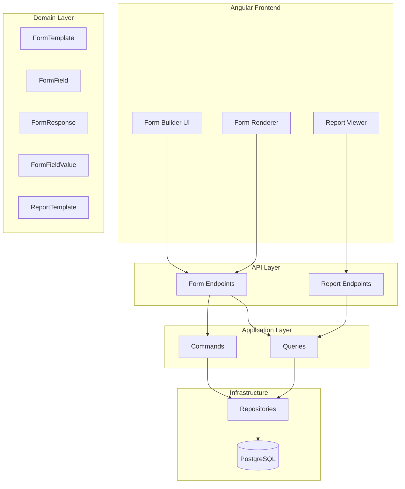

# Dynamic Form Builder Service - Implementation Plan

A Google Forms-like dynamic form builder with DevExpress-style dynamic report generation for the IVF system.

## User Review Required

> [!IMPORTANT]
> **Form Categories**: Should forms be organized by departments (Andrology, Lab, Ultrasound, etc.) or by custom categories? Current plan assumes custom categories managed by admin.

> [!IMPORTANT]
> **Field Types**: The plan includes: Text, Number, Date, Dropdown, Checkbox, Radio, TextArea, File Upload, Rating. Do you need additional field types?

> [!WARNING]
> **Database Migration**: This will add 6 new tables. Please confirm before proceeding.

---

## Architecture Overview



---

## Proposed Changes

### Domain Layer - Entities

#### [NEW] [FormCategory.cs](file:///d:/Pr.Net/IVF/src/IVF.Domain/Entities/FormCategory.cs)
```csharp
public class FormCategory : BaseEntity
{
    public string Name { get; private set; }
    public string? Description { get; private set; }
    public string? IconName { get; private set; }
    public int DisplayOrder { get; private set; }
    public bool IsActive { get; private set; }
    public ICollection<FormTemplate> FormTemplates { get; private set; }
}
```

#### [NEW] [FormTemplate.cs](file:///d:/Pr.Net/IVF/src/IVF.Domain/Entities/FormTemplate.cs)
```csharp
public class FormTemplate : BaseEntity
{
    public Guid CategoryId { get; private set; }
    public string Name { get; private set; }
    public string? Description { get; private set; }
    public string? Version { get; private set; }
    public bool IsPublished { get; private set; }
    public Guid CreatedByUserId { get; private set; }
    
    // Navigation
    public FormCategory Category { get; private set; }
    public ICollection<FormField> Fields { get; private set; }
    public ICollection<FormResponse> Responses { get; private set; }
}
```

#### [NEW] [FormField.cs](file:///d:/Pr.Net/IVF/src/IVF.Domain/Entities/FormField.cs)
```csharp
public class FormField : BaseEntity
{
    public Guid FormTemplateId { get; private set; }
    public string FieldKey { get; private set; }  // unique within form
    public string Label { get; private set; }
    public string? Placeholder { get; private set; }
    public FieldType FieldType { get; private set; }
    public int DisplayOrder { get; private set; }
    public bool IsRequired { get; private set; }
    public string? ValidationRulesJson { get; private set; }  // JSON array of rules
    public string? OptionsJson { get; private set; }  // for dropdown/radio/checkbox
    public string? DefaultValue { get; private set; }
    public string? HelpText { get; private set; }
    public string? ConditionalLogicJson { get; private set; }  // show/hide based on other fields
    
    // Navigation
    public FormTemplate FormTemplate { get; private set; }
}
```

#### [NEW] [FormResponse.cs](file:///d:/Pr.Net/IVF/src/IVF.Domain/Entities/FormResponse.cs)
```csharp
public class FormResponse : BaseEntity
{
    public Guid FormTemplateId { get; private set; }
    public Guid? PatientId { get; private set; }
    public Guid? CycleId { get; private set; }
    public Guid SubmittedByUserId { get; private set; }
    public DateTime SubmittedAt { get; private set; }
    public ResponseStatus Status { get; private set; }
    
    // Navigation
    public FormTemplate FormTemplate { get; private set; }
    public Patient? Patient { get; private set; }
    public TreatmentCycle? Cycle { get; private set; }
    public ICollection<FormFieldValue> FieldValues { get; private set; }
}
```

#### [NEW] [FormFieldValue.cs](file:///d:/Pr.Net/IVF/src/IVF.Domain/Entities/FormFieldValue.cs)
```csharp
public class FormFieldValue : BaseEntity
{
    public Guid FormResponseId { get; private set; }
    public Guid FormFieldId { get; private set; }
    public string? TextValue { get; private set; }
    public decimal? NumericValue { get; private set; }
    public DateTime? DateValue { get; private set; }
    public bool? BooleanValue { get; private set; }
    public string? JsonValue { get; private set; }  // for arrays/complex data
    
    // Navigation
    public FormResponse FormResponse { get; private set; }
    public FormField FormField { get; private set; }
}
```

#### [NEW] [ReportTemplate.cs](file:///d:/Pr.Net/IVF/src/IVF.Domain/Entities/ReportTemplate.cs)
```csharp
public class ReportTemplate : BaseEntity
{
    public Guid FormTemplateId { get; private set; }
    public string Name { get; private set; }
    public string? Description { get; private set; }
    public string ConfigurationJson { get; private set; }  // charts, columns, filters
    public ReportType ReportType { get; private set; }  // Table, Chart, Summary
    public bool IsPublished { get; private set; }
    public Guid CreatedByUserId { get; private set; }
    
    // Navigation
    public FormTemplate FormTemplate { get; private set; }
}
```

---

#### [NEW] [FieldType.cs](file:///d:/Pr.Net/IVF/src/IVF.Domain/Enums/FieldType.cs)
```csharp
public enum FieldType
{
    Text = 1,
    TextArea = 2,
    Number = 3,
    Decimal = 4,
    Date = 5,
    DateTime = 6,
    Time = 7,
    Dropdown = 8,
    MultiSelect = 9,
    Radio = 10,
    Checkbox = 11,
    FileUpload = 12,
    Rating = 13,
    Section = 14,  // for grouping
    Label = 15     // display-only
}

public enum ResponseStatus
{
    Draft = 1,
    Submitted = 2,
    Reviewed = 3,
    Approved = 4,
    Rejected = 5
}

public enum ReportType
{
    Table = 1,
    BarChart = 2,
    LineChart = 3,
    PieChart = 4,
    Summary = 5
}
```

---

### Application Layer

#### [NEW] [IFormRepository.cs](file:///d:/Pr.Net/IVF/src/IVF.Application/Common/Interfaces/IFormRepository.cs)
Repository interfaces for form CRUD operations.

#### [NEW] Form Commands
| File | Purpose |
|------|---------|
| `CreateFormCategoryCommand.cs` | Create new category |
| `CreateFormTemplateCommand.cs` | Create form with fields |
| `UpdateFormTemplateCommand.cs` | Update form structure |
| `PublishFormTemplateCommand.cs` | Mark form as published |
| `SubmitFormResponseCommand.cs` | Submit filled form |

#### [NEW] Form Queries
| File | Purpose |
|------|---------|
| `GetFormCategoriesQuery.cs` | List all categories |
| `GetFormTemplateQuery.cs` | Get single form with fields |
| `GetFormTemplatesByCategoryQuery.cs` | Forms in category |
| `GetFormResponsesQuery.cs` | Responses filtered |
| `GenerateReportQuery.cs` | Dynamic report generation |

---

### Infrastructure Layer

#### [MODIFY] [IvfDbContext.cs](file:///d:/Pr.Net/IVF/src/IVF.Infrastructure/Persistence/IvfDbContext.cs)
Add DbSets for new entities:
```csharp
public DbSet<FormCategory> FormCategories => Set<FormCategory>();
public DbSet<FormTemplate> FormTemplates => Set<FormTemplate>();
public DbSet<FormField> FormFields => Set<FormField>();
public DbSet<FormResponse> FormResponses => Set<FormResponse>();
public DbSet<FormFieldValue> FormFieldValues => Set<FormFieldValue>();
public DbSet<ReportTemplate> ReportTemplates => Set<ReportTemplate>();
```

#### [NEW] Entity Configurations
EF Core configurations for relationships and constraints in `Persistence/Configurations/` folder.

#### [NEW] Database Migration
New migration for form builder tables.

---

### API Layer

#### [NEW] [FormEndpoints.cs](file:///d:/Pr.Net/IVF/src/IVF.API/Endpoints/FormEndpoints.cs)
| Endpoint | Method | Purpose |
|----------|--------|---------|
| `/api/forms/categories` | GET | List categories |
| `/api/forms/categories` | POST | Create category |
| `/api/forms/templates` | GET | List templates |
| `/api/forms/templates` | POST | Create template |
| `/api/forms/templates/{id}` | GET | Get template with fields |
| `/api/forms/templates/{id}` | PUT | Update template |
| `/api/forms/templates/{id}/publish` | POST | Publish form |
| `/api/forms/responses` | POST | Submit response |
| `/api/forms/responses` | GET | List responses |
| `/api/forms/reports` | GET | Generate report |
| `/api/forms/reports/templates` | POST | Create report template |

---

### Frontend - Angular

#### [NEW] Form Builder Module

```
ivf-client/src/app/features/forms/
├── forms.routes.ts
├── forms.service.ts
├── models/
│   ├── form-template.model.ts
│   ├── form-field.model.ts
│   └── form-response.model.ts
├── form-builder/
│   ├── form-builder.component.ts
│   ├── form-builder.component.html
│   └── form-builder.component.scss
├── form-renderer/
│   ├── form-renderer.component.ts      # Displays form for user to fill
│   └── form-renderer.component.html
├── field-components/
│   ├── text-field.component.ts
│   ├── dropdown-field.component.ts
│   ├── checkbox-field.component.ts
│   └── ...other field types
├── form-preview/
│   └── form-preview.component.ts
├── form-responses/
│   └── form-responses.component.ts     # View submitted responses
└── reports/
    ├── report-builder.component.ts
    └── report-viewer.component.ts
```

#### Key Features
1. **Drag & Drop Form Builder** - Visual editor to add/arrange fields
2. **Field Configuration Panel** - Set labels, validation, options
3. **Live Preview** - See form as users will see it
4. **Form Renderer** - Dynamic form display based on template
5. **Response Viewer** - Table view of all submissions
6. **Report Builder** - Configure charts and tables from response data
7. **Report Viewer** - Interactive charts with filters

---

## Verification Plan

### Automated Tests

#### Unit Tests - Domain Entities
```powershell
# Run from project root
cd d:\Pr.Net\IVF
dotnet test tests/IVF.Tests --filter "FullyQualifiedName~FormTemplate"
```
**Test Coverage:**
- `FormTemplate.Create()` creates valid entity
- `FormTemplate.AddField()` adds field in correct order
- `FormField` validation rules JSON serialization
- `FormResponse.Submit()` sets correct status

#### Integration Tests - API Endpoints
```powershell
cd d:\Pr.Net\IVF
dotnet test tests/IVF.Tests --filter "FullyQualifiedName~FormEndpoints"
```
**Test Coverage:**
- Create category returns 201
- Create template with fields persists correctly
- Get template returns fields in order
- Submit response stores all field values
- Get responses with filters works

### Manual Verification

> [!TIP]
> **How to test the Form Builder UI:**
> 1. Run Angular dev server: `cd ivf-client && npm run dev`
> 2. Navigate to `/forms/builder`
> 3. Create a new form with various field types
> 4. Preview the form
> 5. Navigate to `/forms/fill/{id}` and submit a response
> 6. Check responses at `/forms/responses`
> 7. Build a report at `/forms/reports`

### Browser Testing (Automated)
After implementation, I will use the browser subagent to:
1. Navigate to form builder
2. Create a sample form with 5 field types
3. Submit test responses
4. Generate a report

---

## Implementation Order

1. **Domain entities** (FormCategory → FormTemplate → FormField → FormResponse → FormFieldValue → ReportTemplate)
2. **Enums** (FieldType, ResponseStatus, ReportType)
3. **Repository interfaces**
4. **DbContext + Configurations**
5. **Database migration**
6. **Repository implementations**
7. **CQRS Commands/Queries**
8. **API Endpoints**
9. **Frontend service + models**
10. **Frontend components**
11. **Tests**


Phân Tích Tính Năng WordPress Form Builder Áp Dụng Cho IVF FormBuilder
Hiện Trạng Hệ Thống (16 FieldTypes, 11 exposed in palette)
Có rồi	Chưa có trong palette
Text, TextArea, Number, Date, Dropdown, Radio, Checkbox, Tags, Rating, Section, FileUpload	Decimal, DateTime, Time, MultiSelect, Label
TIER 1 — Ưu Tiên Cao (Impact trực tiếp đến UX y tế)
1. Repeater Field (WPForms Repeater)
Mô tả: Cho phép user thêm nhóm field lặp lại (ví dụ: nhiều thuốc, nhiều lần xét nghiệm)
Use case IVF: Kê đơn thuốc (Tên + Liều + Tần suất) × N, Tiền sử phẫu thuật × N, Danh sách phôi × N
Implementation:
Thêm FieldType.Repeater = 17
Domain: RepeatConfig { minRows, maxRows, fields: FormField[] } lưu trong OptionsJson
Renderer: Render group fields + nút "Thêm dòng" / "Xóa dòng"
Value storage: JsonValue = [{field1: val, field2: val}, ...]
Effort: Lớn — cần nested form groups trong Angular ReactiveFormsModule
2. Multi-Step Forms / Page Break (WPForms Multi-Page)
Mô tả: Chia form dài thành nhiều bước/trang với progress indicator
Use case IVF: Form khám ban đầu (Thông tin cá nhân → Tiền sử → Xét nghiệm → Kết luận), Protocol IVF nhiều giai đoạn
Implementation:
Thêm FieldType.PageBreak = 18 hoặc mở rộng Section thành page separator
Renderer: Step navigation, progress bar, validate per-step trước khi chuyển
Builder: Visual page divider trong canvas
Effort: Trung bình — chủ yếu UI trong form-renderer
3. Calculated Fields (WPForms Calculations)
Mô tả: Field tự động tính toán từ giá trị các field khác
Use case IVF: BMI = Cân nặng / (Chiều cao²), Tổng motile sperm count = Volume × Concentration × Motility%, AFC (antral follicle count), Conversion rates
Implementation:
Thêm FieldType.Calculated = 19
FormulaJson: "({weight} / ({height}/100)^2)" — reference by fieldKey
Renderer: Reactive calculation trên valueChanges, display kết quả (read-only)
Precision config: decimalPlaces, unit (kg, ml, etc.)
Effort: Trung bình — cần formula parser (có thể dùng math.js)
4. Rich Text Editor (WPForms Rich Text)
Mô tả: WYSIWYG editor cho ghi chú lâm sàng
Use case IVF: Ghi chú bác sĩ, Kết luận siêu âm, Mô tả phôi chi tiết
Implementation:
Thêm FieldType.RichText = 20
Angular: Tích hợp ngx-quill hoặc @ckeditor/ckeditor5-angular
Value storage: TextValue = HTML string
Effort: Nhỏ — chỉ cần thêm component + package
5. Address / Composite Field (WPForms Address)
Mô tả: Field phức hợp gồm nhiều sub-field (Address: Street + Ward + District + Province + Country)
Use case IVF: Địa chỉ bệnh nhân, Thông tin BHYT, Thông tin liên hệ khẩn cấp (Tên + SĐT + Quan hệ)
Implementation:
Thêm FieldType.Composite = 21
OptionsJson mô tả sub-fields: [{key, label, type, required, width}]
Value storage: JsonValue = {street: "...", district: "...", ...}
Effort: Trung bình
TIER 2 — Ưu Tiên Trung Bình (Cải thiện UX đáng kể)
6. Save & Resume (Draft)
Mô tả: Tự động lưu draft, cho phép quay lại hoàn thành sau
Hiện trạng: Đã có ResponseStatus.Draft nhưng chưa auto-save
Implementation: Auto-save debounce (mỗi 30s), API PUT /responses/{id} với status=Draft, danh sách "Continue filling" trên dashboard
Effort: Nhỏ — chỉ cần thêm debounceTime auto-save trong renderer
7. Entry Preview / Review Step
Mô tả: Bước xem lại tất cả câu trả lời trước khi submit
Use case IVF: Bác sĩ review toàn bộ form trước khi xác nhận
Implementation: Thêm review step cuối trong form-renderer, read-only display tất cả values
Effort: Nhỏ
8. Hidden Field
Mô tả: Field ẩn chứa giá trị tự động (user ID, timestamp, source URL, cycle phase)
Use case IVF: Auto-fill CycleId, DoctorId, ClinicBranch, ProtocolPhase
Implementation: FieldType.Hidden = 22, default value supports dynamic tokens {currentUser}, {currentCycle}
Effort: Nhỏ
9. Validation Rules — Hoàn thiện
Hiện trạng: Interface có minLength, maxLength, min, max, pattern, email nhưng buildForm() CHỈ dùng Validators.required
Cần làm: Wire tất cả validators vào buildForm(), hiển thị error messages tùy chỉnh, thêm builder UI cho từng rule
Effort: Nhỏ — code đã có interface, chỉ cần kết nối
10. Digital Signature (WPForms Signature)
Mô tả: Canvas vẽ chữ ký điện tử
Use case IVF: Cam kết đồng ý IVF, Phiếu đồng ý phẫu thuật, Xác nhận bệnh nhân
Implementation: FieldType.Signature = 23, dùng signature_pad library, save as Base64 PNG
Effort: Nhỏ-Trung bình
11. Number Slider / Range
Mô tả: Thanh trượt chọn giá trị số trong khoảng
Use case IVF: Pain scale (0-10), Satisfaction score, Dosage selection
Implementation: FieldType.Slider = 24, config: {min, max, step, unit}
Effort: Nhỏ
12. Lookup / Data Source Field
Mô tả: Dropdown động lấy dữ liệu từ API (danh sách bệnh nhân, bác sĩ, thuốc)
Use case IVF: Chọn bệnh nhân (autocomplete), Chọn bác sĩ, Chọn thuốc từ ServiceCatalog
Implementation: FieldType.Lookup = 25, config: {dataSource: 'patients'|'users'|'services', displayField, valueField}
Effort: Trung bình — cần generic API + typeahead search
TIER 3 — Ưu Tiên Thấp (Nice-to-have)
13. PDF Export (WPForms PDF)
Mô tả: Xuất form response thành PDF (phiếu kết quả, đơn thuốc)
Use case IVF: In phiếu kết quả xét nghiệm, Phiếu đồng ý, Tóm tắt điều trị
Implementation: Backend: QuestPDF hoặc DinkToPdf, endpoint GET /responses/{id}/pdf
Effort: Trung bình
14. Conversational Forms (WPForms Conversational)
Mô tả: Form hiển thị từng câu hỏi một (chat-like), tăng completion rate
Use case IVF: Form khảo sát bệnh nhân trên mobile
Implementation: Chế độ render thay thế trong form-renderer, 1 field/screen + animation
Effort: Trung bình
15. Form Templates Library
Mô tả: Thư viện form mẫu cho IVF (Semen Analysis, IVF Protocol, Egg Retrieval, etc.)
Implementation: Seed data với pre-built form templates, "Use Template" button
Effort: Nhỏ — chủ yếu là tạo dữ liệu mẫu
16. Geolocation Auto-fill
Mô tả: Tự động điền địa chỉ từ GPS
Effort: Nhỏ — sử dụng browser Geolocation API
17. Email / Phone / URL Fields (Typed input)
Mô tả: Field input chuyên biệt với validation
Implementation: Thêm FieldType.Email = 26, FieldType.Phone = 27, FieldType.Url = 28 — hoặc mở rộng Text field với inputType config
Effort: Rất nhỏ
Quick Wins — Sửa ngay với effort nhỏ
#	Feature	Mô tả	Effort
A	Expose missing palette items	Thêm Decimal, DateTime, Time, MultiSelect, Label vào builder palette	5 dòng code
B	Wire validation rules	Kết nối minLength/maxLength/min/max/pattern/email trong buildForm()	~30 dòng
C	Validation rules UI in builder	Thêm panel builder để config min/max/pattern per field type	~100 dòng
D	Separate layout from validation	Tách colSpan/height ra khỏi validationRulesJson vào layoutJson riêng	Refactor nhỏ
E	Auto-save draft	debounceTime(30000) trên form.valueChanges → auto PUT draft	~20 dòng
Roadmap Đề Xuất
Domain Changes Summary
Bảng So Sánh với WordPress Form Builders
Feature	WPForms	Gravity Forms	IVF Hiện Tại	Đề Xuất
Drag & Drop Builder	✅	✅	✅	—
Conditional Logic	✅	✅	✅	—
Multi-Step Forms	✅	✅	❌	Phase 2
Repeater Fields	✅	✅ (List)	❌	Phase 2
Calculated Fields	✅	✅	❌	Phase 2
File Upload	✅	✅	✅ (basic)	Enhance
Rich Text	✅	✅	❌	Phase 3
Digital Signature	✅	✅	❌	Phase 3
Save & Resume	✅	✅ (Save & Continue)	❌ (Draft exists)	Phase 1
Entry Preview	✅	✅	❌	Phase 1
Hidden Fields	✅	✅	❌	Phase 2
Address/Composite	✅	✅	❌	Phase 4
Lookup/Dynamic	❌	✅ (Dynamic)	❌	Phase 3
Number Slider	✅	✅	❌	Phase 3
PDF Export	✅	✅	❌	Phase 4
Form Templates	✅ (2000+)	✅	❌	Phase 4
Conversational	✅	❌	❌	Phase 5
Medical Concepts	❌	❌	✅ (SNOMED/HL7)	Unique advantage
Tags/Mentions	❌	❌	✅	Unique advantage
Report Builder	❌	❌	✅ (5 types)	Unique advantage
