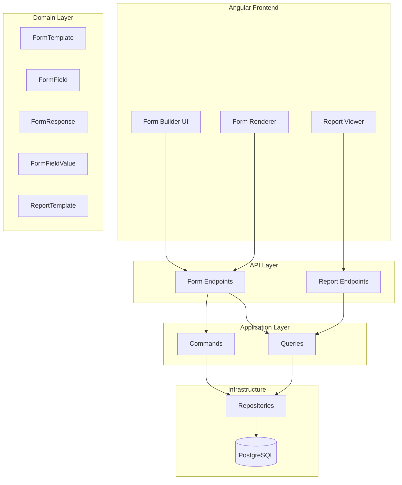

# Dynamic Form Builder Service - Implementation Plan

A Google Forms-like dynamic form builder with DevExpress-style dynamic report generation for the IVF system.

## User Review Required

> [!IMPORTANT]
> **Form Categories**: Should forms be organized by departments (Andrology, Lab, Ultrasound, etc.) or by custom categories? Current plan assumes custom categories managed by admin.

> [!IMPORTANT]
> **Field Types**: The plan includes: Text, Number, Date, Dropdown, Checkbox, Radio, TextArea, File Upload, Rating. Do you need additional field types?

> [!WARNING]
> **Database Migration**: This will add 6 new tables. Please confirm before proceeding.

---

## Architecture Overview



---

## Proposed Changes

### Domain Layer - Entities

#### [NEW] [FormCategory.cs](file:///d:/Pr.Net/IVF/src/IVF.Domain/Entities/FormCategory.cs)
```csharp
public class FormCategory : BaseEntity
{
    public string Name { get; private set; }
    public string? Description { get; private set; }
    public string? IconName { get; private set; }
    public int DisplayOrder { get; private set; }
    public bool IsActive { get; private set; }
    public ICollection<FormTemplate> FormTemplates { get; private set; }
}
```

#### [NEW] [FormTemplate.cs](file:///d:/Pr.Net/IVF/src/IVF.Domain/Entities/FormTemplate.cs)
```csharp
public class FormTemplate : BaseEntity
{
    public Guid CategoryId { get; private set; }
    public string Name { get; private set; }
    public string? Description { get; private set; }
    public string? Version { get; private set; }
    public bool IsPublished { get; private set; }
    public Guid CreatedByUserId { get; private set; }
    
    // Navigation
    public FormCategory Category { get; private set; }
    public ICollection<FormField> Fields { get; private set; }
    public ICollection<FormResponse> Responses { get; private set; }
}
```

#### [NEW] [FormField.cs](file:///d:/Pr.Net/IVF/src/IVF.Domain/Entities/FormField.cs)
```csharp
public class FormField : BaseEntity
{
    public Guid FormTemplateId { get; private set; }
    public string FieldKey { get; private set; }  // unique within form
    public string Label { get; private set; }
    public string? Placeholder { get; private set; }
    public FieldType FieldType { get; private set; }
    public int DisplayOrder { get; private set; }
    public bool IsRequired { get; private set; }
    public string? ValidationRulesJson { get; private set; }  // JSON array of rules
    public string? OptionsJson { get; private set; }  // for dropdown/radio/checkbox
    public string? DefaultValue { get; private set; }
    public string? HelpText { get; private set; }
    public string? ConditionalLogicJson { get; private set; }  // show/hide based on other fields
    
    // Navigation
    public FormTemplate FormTemplate { get; private set; }
}
```

#### [NEW] [FormResponse.cs](file:///d:/Pr.Net/IVF/src/IVF.Domain/Entities/FormResponse.cs)
```csharp
public class FormResponse : BaseEntity
{
    public Guid FormTemplateId { get; private set; }
    public Guid? PatientId { get; private set; }
    public Guid? CycleId { get; private set; }
    public Guid SubmittedByUserId { get; private set; }
    public DateTime SubmittedAt { get; private set; }
    public ResponseStatus Status { get; private set; }
    
    // Navigation
    public FormTemplate FormTemplate { get; private set; }
    public Patient? Patient { get; private set; }
    public TreatmentCycle? Cycle { get; private set; }
    public ICollection<FormFieldValue> FieldValues { get; private set; }
}
```

#### [NEW] [FormFieldValue.cs](file:///d:/Pr.Net/IVF/src/IVF.Domain/Entities/FormFieldValue.cs)
```csharp
public class FormFieldValue : BaseEntity
{
    public Guid FormResponseId { get; private set; }
    public Guid FormFieldId { get; private set; }
    public string? TextValue { get; private set; }
    public decimal? NumericValue { get; private set; }
    public DateTime? DateValue { get; private set; }
    public bool? BooleanValue { get; private set; }
    public string? JsonValue { get; private set; }  // for arrays/complex data
    
    // Navigation
    public FormResponse FormResponse { get; private set; }
    public FormField FormField { get; private set; }
}
```

#### [NEW] [ReportTemplate.cs](file:///d:/Pr.Net/IVF/src/IVF.Domain/Entities/ReportTemplate.cs)
```csharp
public class ReportTemplate : BaseEntity
{
    public Guid FormTemplateId { get; private set; }
    public string Name { get; private set; }
    public string? Description { get; private set; }
    public string ConfigurationJson { get; private set; }  // charts, columns, filters
    public ReportType ReportType { get; private set; }  // Table, Chart, Summary
    public bool IsPublished { get; private set; }
    public Guid CreatedByUserId { get; private set; }
    
    // Navigation
    public FormTemplate FormTemplate { get; private set; }
}
```

---

#### [NEW] [FieldType.cs](file:///d:/Pr.Net/IVF/src/IVF.Domain/Enums/FieldType.cs)
```csharp
public enum FieldType
{
    Text = 1,
    TextArea = 2,
    Number = 3,
    Decimal = 4,
    Date = 5,
    DateTime = 6,
    Time = 7,
    Dropdown = 8,
    MultiSelect = 9,
    Radio = 10,
    Checkbox = 11,
    FileUpload = 12,
    Rating = 13,
    Section = 14,  // for grouping
    Label = 15     // display-only
}

public enum ResponseStatus
{
    Draft = 1,
    Submitted = 2,
    Reviewed = 3,
    Approved = 4,
    Rejected = 5
}

public enum ReportType
{
    Table = 1,
    BarChart = 2,
    LineChart = 3,
    PieChart = 4,
    Summary = 5
}
```

---

### Application Layer

#### [NEW] [IFormRepository.cs](file:///d:/Pr.Net/IVF/src/IVF.Application/Common/Interfaces/IFormRepository.cs)
Repository interfaces for form CRUD operations.

#### [NEW] Form Commands
| File | Purpose |
|------|---------|
| `CreateFormCategoryCommand.cs` | Create new category |
| `CreateFormTemplateCommand.cs` | Create form with fields |
| `UpdateFormTemplateCommand.cs` | Update form structure |
| `PublishFormTemplateCommand.cs` | Mark form as published |
| `SubmitFormResponseCommand.cs` | Submit filled form |

#### [NEW] Form Queries
| File | Purpose |
|------|---------|
| `GetFormCategoriesQuery.cs` | List all categories |
| `GetFormTemplateQuery.cs` | Get single form with fields |
| `GetFormTemplatesByCategoryQuery.cs` | Forms in category |
| `GetFormResponsesQuery.cs` | Responses filtered |
| `GenerateReportQuery.cs` | Dynamic report generation |

---

### Infrastructure Layer

#### [MODIFY] [IvfDbContext.cs](file:///d:/Pr.Net/IVF/src/IVF.Infrastructure/Persistence/IvfDbContext.cs)
Add DbSets for new entities:
```csharp
public DbSet<FormCategory> FormCategories => Set<FormCategory>();
public DbSet<FormTemplate> FormTemplates => Set<FormTemplate>();
public DbSet<FormField> FormFields => Set<FormField>();
public DbSet<FormResponse> FormResponses => Set<FormResponse>();
public DbSet<FormFieldValue> FormFieldValues => Set<FormFieldValue>();
public DbSet<ReportTemplate> ReportTemplates => Set<ReportTemplate>();
```

#### [NEW] Entity Configurations
EF Core configurations for relationships and constraints in `Persistence/Configurations/` folder.

#### [NEW] Database Migration
New migration for form builder tables.

---

### API Layer

#### [NEW] [FormEndpoints.cs](file:///d:/Pr.Net/IVF/src/IVF.API/Endpoints/FormEndpoints.cs)
| Endpoint | Method | Purpose |
|----------|--------|---------|
| `/api/forms/categories` | GET | List categories |
| `/api/forms/categories` | POST | Create category |
| `/api/forms/templates` | GET | List templates |
| `/api/forms/templates` | POST | Create template |
| `/api/forms/templates/{id}` | GET | Get template with fields |
| `/api/forms/templates/{id}` | PUT | Update template |
| `/api/forms/templates/{id}/publish` | POST | Publish form |
| `/api/forms/responses` | POST | Submit response |
| `/api/forms/responses` | GET | List responses |
| `/api/forms/reports` | GET | Generate report |
| `/api/forms/reports/templates` | POST | Create report template |

---

### Frontend - Angular

#### [NEW] Form Builder Module

```
ivf-client/src/app/features/forms/
├── forms.routes.ts
├── forms.service.ts
├── models/
│   ├── form-template.model.ts
│   ├── form-field.model.ts
│   └── form-response.model.ts
├── form-builder/
│   ├── form-builder.component.ts
│   ├── form-builder.component.html
│   └── form-builder.component.scss
├── form-renderer/
│   ├── form-renderer.component.ts      # Displays form for user to fill
│   └── form-renderer.component.html
├── field-components/
│   ├── text-field.component.ts
│   ├── dropdown-field.component.ts
│   ├── checkbox-field.component.ts
│   └── ...other field types
├── form-preview/
│   └── form-preview.component.ts
├── form-responses/
│   └── form-responses.component.ts     # View submitted responses
└── reports/
    ├── report-builder.component.ts
    └── report-viewer.component.ts
```

#### Key Features
1. **Drag & Drop Form Builder** - Visual editor to add/arrange fields
2. **Field Configuration Panel** - Set labels, validation, options
3. **Live Preview** - See form as users will see it
4. **Form Renderer** - Dynamic form display based on template
5. **Response Viewer** - Table view of all submissions
6. **Report Builder** - Configure charts and tables from response data
7. **Report Viewer** - Interactive charts with filters

---

## Verification Plan

### Automated Tests

#### Unit Tests - Domain Entities
```powershell
# Run from project root
cd d:\Pr.Net\IVF
dotnet test tests/IVF.Tests --filter "FullyQualifiedName~FormTemplate"
```
**Test Coverage:**
- `FormTemplate.Create()` creates valid entity
- `FormTemplate.AddField()` adds field in correct order
- `FormField` validation rules JSON serialization
- `FormResponse.Submit()` sets correct status

#### Integration Tests - API Endpoints
```powershell
cd d:\Pr.Net\IVF
dotnet test tests/IVF.Tests --filter "FullyQualifiedName~FormEndpoints"
```
**Test Coverage:**
- Create category returns 201
- Create template with fields persists correctly
- Get template returns fields in order
- Submit response stores all field values
- Get responses with filters works

### Manual Verification

> [!TIP]
> **How to test the Form Builder UI:**
> 1. Run Angular dev server: `cd ivf-client && npm run dev`
> 2. Navigate to `/forms/builder`
> 3. Create a new form with various field types
> 4. Preview the form
> 5. Navigate to `/forms/fill/{id}` and submit a response
> 6. Check responses at `/forms/responses`
> 7. Build a report at `/forms/reports`

### Browser Testing (Automated)
After implementation, I will use the browser subagent to:
1. Navigate to form builder
2. Create a sample form with 5 field types
3. Submit test responses
4. Generate a report

---

## Implementation Order

1. **Domain entities** (FormCategory → FormTemplate → FormField → FormResponse → FormFieldValue → ReportTemplate)
2. **Enums** (FieldType, ResponseStatus, ReportType)
3. **Repository interfaces**
4. **DbContext + Configurations**
5. **Database migration**
6. **Repository implementations**
7. **CQRS Commands/Queries**
8. **API Endpoints**
9. **Frontend service + models**
10. **Frontend components**
11. **Tests**
