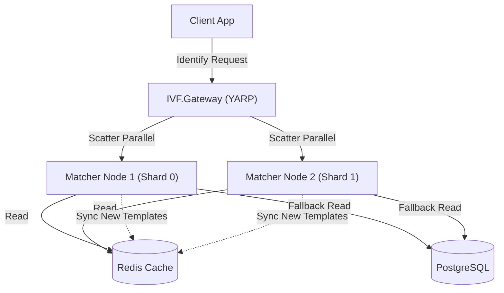

# Scalable Biometric Matcher Infrastructure Guide

This guide details the architecture, configuration, and deployment steps for the high-performance, scalable biometric matching system designed for 1 million+ users.

## 1. System Architecture

The system uses a **Sharded Architecture** with an **API Gateway** aggregator and **Redis** distribution/caching layer.



## 6. Capacity Planning (Scaling for 1M+ Users)

To scale the system successfully, you must provision appropriate resources for Redis and the Matcher Nodes.

### 6.1. Storage Calculation (Per User)

Each fingerprint record stored in Redis consists of:
*   **Key**: `PatientId` (GUID)
*   **Value**: `FingerType|Base64EncodedTemplate`

**Approximate Size Per User**: ~1.4 KB

### 6.2. RAM Requirements

The following table estimates the RAM usage for different user scales.

| User Count | Raw Data Size | Redis RAM (Recommended) | API Node RAM (Total) |
| :--- | :--- | :--- | :--- |
| **10,000** | 14 MB | **~20 MB** | ~14 MB |
| **100,000** | 140 MB | **~200 MB** | ~140 MB |
| **1,000,000** | 1.4 GB | **~2 - 4 GB** | ~700 MB - 1 GB (Per Node) |
| **5,000,000** | 7 GB | **~10 GB** | ~3.5 GB (Distributed) |

> **Recommendation for 1 Million Users**:
> *   **Redis**: 4 GB RAM
> *   **Matcher Nodes**: 2 Nodes, each with 2 GB RAM allocated.

## 2. Prerequisites

- **Redis**: Required for high-speed template access.
- **PostgreSQL**: Persistent storage for patient records and fingerprints.
- **.NET 8/9 SDK**: To run the API and Gateway.

## 3. Configuration

### 3.1. Matcher Nodes (IVF.API)
Each API instance acts as a "Matcher Node" responsible for a subset of data.

**File**: `src/IVF.API/appsettings.json`

```json
{
  "ConnectionStrings": {
    "DefaultConnection": "Host=localhost;...",
    "Redis": "localhost:6379"  <-- Redis Connection
  },
  "Matcher": {
    "ShardId": 0,       <-- Unique ID for this node (0, 1, 2...)
    "TotalShards": 1    <-- Total number of nodes in the cluster
  }
}
```

### 3.2. API Gateway (IVF.Gateway)
The Gateway routes requests and aggregates results.

**File**: `src/IVF.Gateway/appsettings.json`

```json
"ReverseProxy": {
  "Clusters": {
    "biometrics-cluster": {
      "Destinations": {
        "node1": { "Address": "https://localhost:7001" }, <-- Address of Node 1
        "node2": { "Address": "https://localhost:7002" }  <-- Address of Node 2
      }
    }
  }
}
```

## 4. Running the System

### Step 1: Start Infrastructure (Redis & DB)
Run Docker Compose to start Redis and PostgreSQL.

```powershell
docker-compose up -d
```
*Verify Redis is running on port 6379.*

### Step 2: Start Matcher Nodes
Run multiple instances of the API on different ports with different Shard IDs.

**Node 1 (Shard 0)**
```powershell
# In a new terminal
$env:ASPNETCORE_URLS="https://localhost:7001"
$env:Matcher__ShardId=0
$env:Matcher__TotalShards=2
dotnet run --project src/IVF.API
```

**Node 2 (Shard 1)**
```powershell
# In a separate terminal
$env:ASPNETCORE_URLS="https://localhost:7002"
$env:Matcher__ShardId=1
$env:Matcher__TotalShards=2
dotnet run --project src/IVF.API
```

### Step 3: Start API Gateway
Run the Gateway project.

```powershell
# In a separate terminal
$env:ASPNETCORE_URLS="https://localhost:5000"
dotnet run --project src/IVF.Gateway
```

## 5. Verification

Send an Identification request to the **Gateway**. It will query both Node 1 and Node 2, and return the best match.

**Endpoint**: `POST https://localhost:5000/api/gateway/biometrics/identify`
**Body**:
```json
{
  "FeatureSet": "Base64EncodedFeatureSetData..."
}
```

The system will:
1.  Gateway receives request.
2.  Gateway sends request to Node 1 and Node 2 in parallel.
3.  Nodes perform matching against their local in-memory cache (loaded from Redis).
4.  Gateway aggregates results and returns the best match.
