# Wazuh SIEM & Lynis Security Auditing — Hướng dẫn & Luồng hoạt động

> **Tài liệu này** mô tả toàn bộ kiến trúc, luồng dữ liệu, cách triển khai và tích hợp của **Wazuh 4.9.2** (SIEM) và **Lynis** (Security Auditing) trên hạ tầng IVF Platform.

---

## Mục lục

1. [Tổng quan kiến trúc](#1-tổng-quan-kiến-trúc)
2. [Wazuh — Kiến trúc chi tiết](#2-wazuh--kiến-trúc-chi-tiết)
3. [Wazuh — Luồng dữ liệu end-to-end](#3-wazuh--luồng-dữ-liệu-end-to-end)
4. [Wazuh — Agent monitoring Docker Swarm](#4-wazuh--agent-monitoring-docker-swarm)
5. [Wazuh — Alert pipeline & Active Response](#5-wazuh--alert-pipeline--active-response)
6. [Wazuh — Triển khai & Vận hành](#6-wazuh--triển-khai--vận-hành)
7. [Lynis — Kiến trúc & Luồng audit](#7-lynis--kiến-trúc--luồng-audit)
8. [Lynis — Tích hợp Wazuh & MinIO](#8-lynis--tích-hợp-wazuh--minio)
9. [Tích hợp tổng thể Wazuh + Lynis](#9-tích-hợp-tổng-thể-wazuh--lynis)
10. [Hardening Ansible Role — Nâng cao Lynis Score](#10-hardening-ansible-role--nâng-cao-lynis-score)
11. [Tham chiếu: Ports, Credentials, Rule IDs](#11-tham-chiếu-ports-credentials-rule-ids)

---

## 1. Tổng quan kiến trúc

### Topology hạ tầng

```
┌──────────────────────────────────────────────────────────────────────────────┐
│                            IVF Platform — 2 VPS                             │
│                                                                              │
│  ┌────────────────────────────────┐   ┌──────────────────────────────────┐  │
│  │  VPS1 (vmi3129107)            │   │  VPS2 (vmi3129111)               │  │
│  │  IP: 194.163.181.19           │   │  IP: 45.134.226.56               │  │
│  │  Docker Swarm: Leader         │   │  Docker Swarm: Reachable          │  │
│  │  Role: Standby                │   │  Role: Primary                    │  │
│  │                               │   │                                   │  │
│  │  ┌─────────────────────────┐  │   │  ┌─────────────────────────────┐  │  │
│  │  │  wazuh-agent (native)   │  │   │  │  wazuh-agent (native)       │  │  │
│  │  │  ID: 002                │  │   │  │  ID: 001                    │  │  │
│  │  │  systemd managed        │  │   │  │  systemd managed             │  │  │
│  │  └────────────┬────────────┘  │   │  └──────────────┬──────────────┘  │  │
│  │               │               │   │                  │                │  │
│  │  ┌─────────────────────────┐  │   │  ┌─────────────────────────────┐  │  │
│  │  │  IVF Stack (Swarm)      │  │   │  │  Wazuh Stack (Swarm + ivf) │  │  │
│  │  │  (API, EJBCA, SignSrv)  │  │   │  │  wazuh-manager             │  │  │
│  │  └─────────────────────────┘  │   │  │  wazuh-indexer (OpenSearch) │  │  │
│  │                               │   │  │  wazuh-dashboard            │  │  │
│  └────────────────────────────────┘   │  └─────────────────────────────┘  │  │
│                                       └──────────────────────────────────┘  │
│                                                                              │
│  WireGuard VPN: 10.200.0.1 (VPS2) ←──────── 10.200.0.2 (VPS1)              │
│  Internet access: https://natra.site/wazuh/ (Caddy → VPS2:5601)             │
└──────────────────────────────────────────────────────────────────────────────┘
```

### Thành phần chính

| Thành phần             | Version | Node     | Vai trò                                     |
| ---------------------- | ------- | -------- | ------------------------------------------- |
| **wazuh-manager**      | 4.9.2   | VPS2     | Nhận/phân tích log từ agents, quản lý rules |
| **wazuh-indexer**      | 4.9.2   | VPS2     | Lưu trữ alerts/events (OpenSearch)          |
| **wazuh-dashboard**    | 4.9.2   | VPS2     | Giao diện web phân tích bảo mật             |
| **wazuh-agent (VPS1)** | 4.9.2   | VPS1     | Thu thập log/events từ VPS1, gửi về manager |
| **wazuh-agent (VPS2)** | 4.9.2   | VPS2     | Thu thập log/events từ VPS2, gửi về manager |
| **Lynis**              | latest  | cả 2 VPS | Audit bảo mật hệ thống hàng tuần            |

---

## 2. Wazuh — Kiến trúc chi tiết

### Sơ đồ thành phần

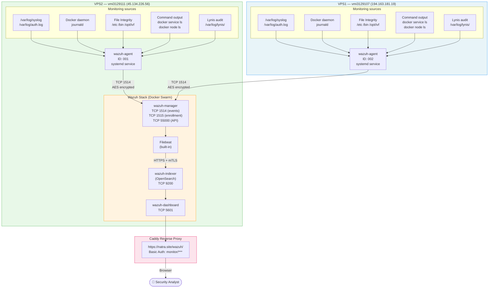

### Internal communication trong Wazuh Stack

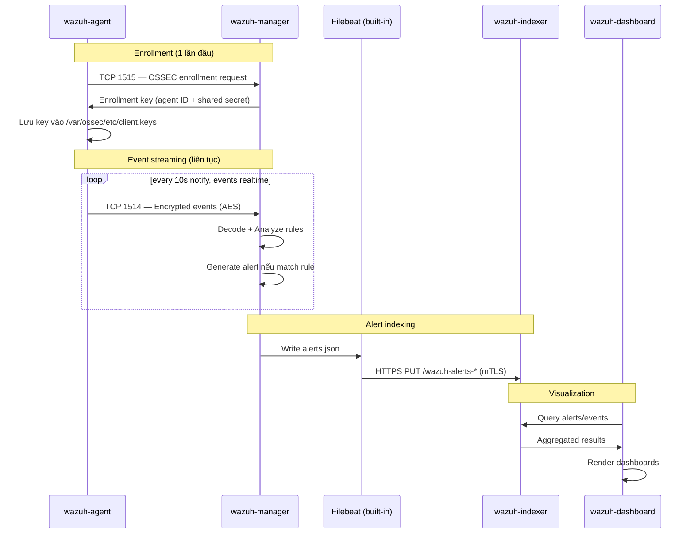

---

## 3. Wazuh — Luồng dữ liệu end-to-end

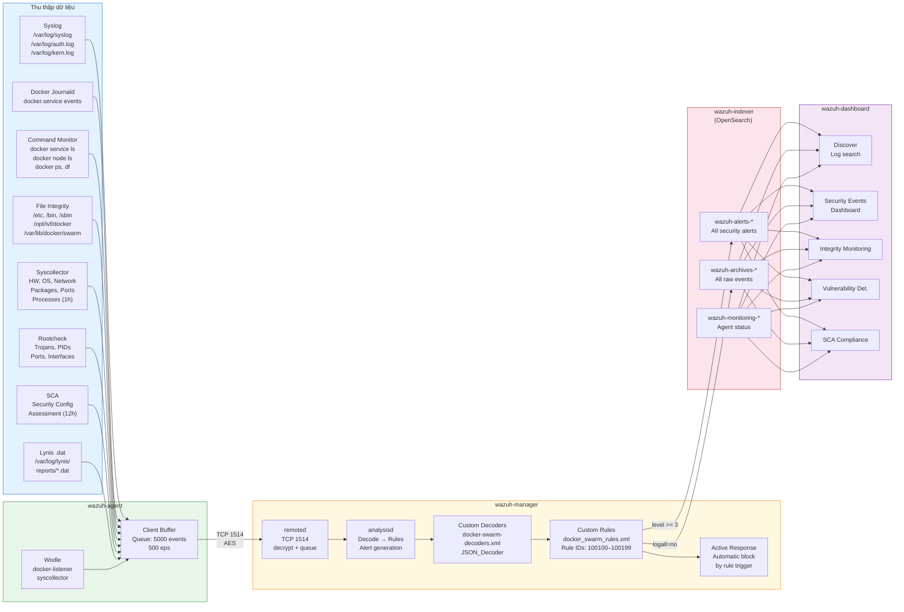

---

## 4. Wazuh — Agent monitoring Docker Swarm

Đây là tính năng **tùy chỉnh** của IVF platform — agent thu thập trạng thái Docker Swarm thông qua `full_command` wodle.

### Luồng giám sát Docker Swarm

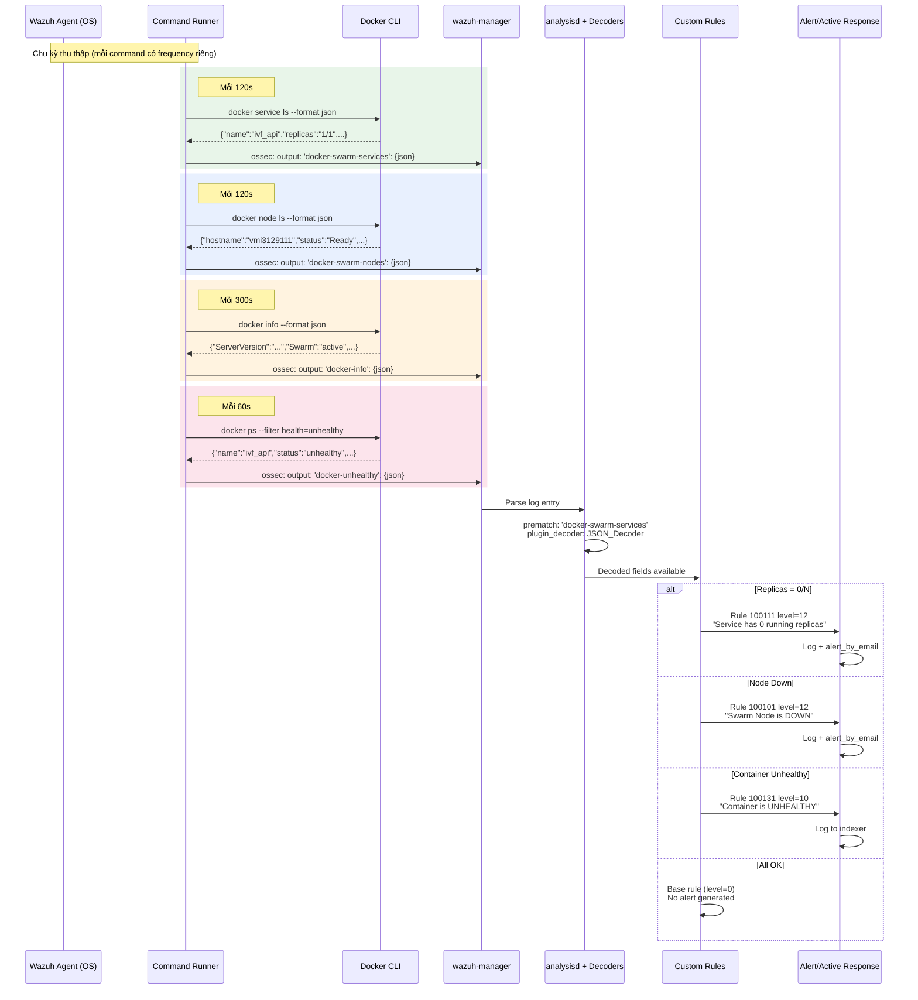

### Custom Decoders cho Docker Swarm (`docker_swarm_decoders.xml`)

```xml
<!-- Mỗi command alias có 1 decoder riêng biệt -->
<decoder name="docker-swarm-services">
  <prematch>^ossec: output: 'docker-swarm-services': </prematch>
  <plugin_decoder offset="after_prematch">JSON_Decoder</plugin_decoder>
</decoder>

<decoder name="docker-swarm-nodes">
  <prematch>^ossec: output: 'docker-swarm-nodes': </prematch>
  <plugin_decoder offset="after_prematch">JSON_Decoder</plugin_decoder>
</decoder>
```

### Custom Rules — ID range & mức độ

| Rule ID    | Trigger                       | Level     | Group                     |
| ---------- | ----------------------------- | --------- | ------------------------- |
| 100100     | Node status received          | 0 (base)  | docker-swarm-nodes        |
| **100101** | Node status = **Down**        | **12** 🔴 | swarm-critical            |
| 100102     | Node availability = Drain     | 7 🟡      | swarm-warning             |
| 100103     | Node availability = Pause     | 7 🟡      | swarm-warning             |
| 100110     | Service list received         | 0 (base)  | docker-swarm-services     |
| **100111** | Service replicas = **0/N**    | **12** 🔴 | swarm-critical            |
| 100112     | Service replicas degraded     | 8 🟠      | swarm-warning             |
| 100120     | Docker info received          | 0 (base)  | docker-info               |
| 100121     | Swarm mode NOT active         | 10 🔴     | swarm-critical            |
| 100122     | Stopped containers > 20       | 5 🟡      | docker-maintenance        |
| 100130     | Unhealthy check received      | 0 (base)  | docker-unhealthy          |
| **100131** | Container **UNHEALTHY**       | **10** 🔴 | swarm-critical            |
| 100140     | Failed tasks received         | 0 (base)  | docker-swarm-failed-tasks |
| **100141** | Task **failed/rejected**      | **10** 🔴 | swarm-critical            |
| **100150** | SSH brute force (10+ in 2min) | **10** 🔴 | ssh-brute-force           |
| **100160** | `/etc/docker/` modified       | **10** 🔴 | docker-config-change      |
| **100161** | Docker Swarm secret/config    | **12** 🔴 | docker-config-change      |

---

## 5. Wazuh — Alert pipeline & Active Response

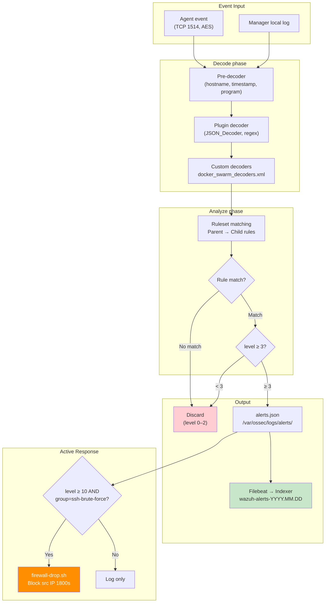

### File Integrity Monitoring (FIM) flow

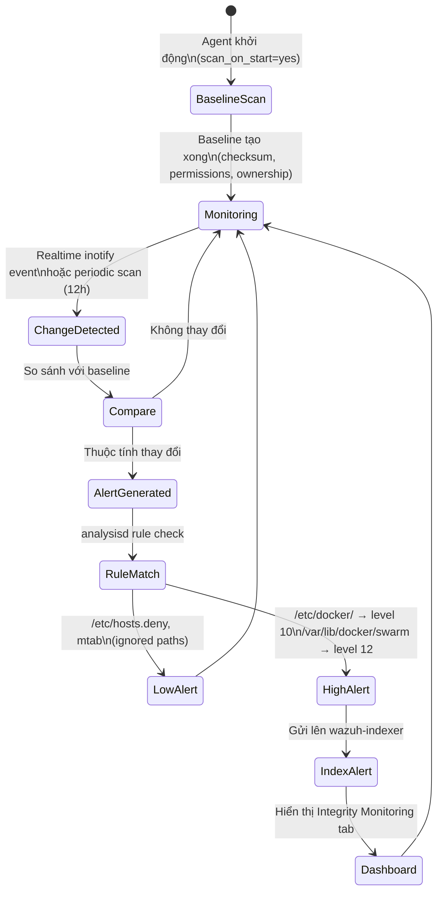

**Thư mục được giám sát (realtime):**

- `/etc/ssh` — SSH config changes
- `/etc/docker` — Docker daemon config
- `/opt/ivf/docker` — IVF app config
- `/var/lib/docker/swarm` — Swarm secrets/configs

**Thư mục bị loại trừ (high-churn):**

- `/var/lib/docker/containers`, `/overlay2`, `/network`, `/volumes`

---

## 6. Wazuh — Triển khai & Vận hành

### Quy trình triển khai ban đầu

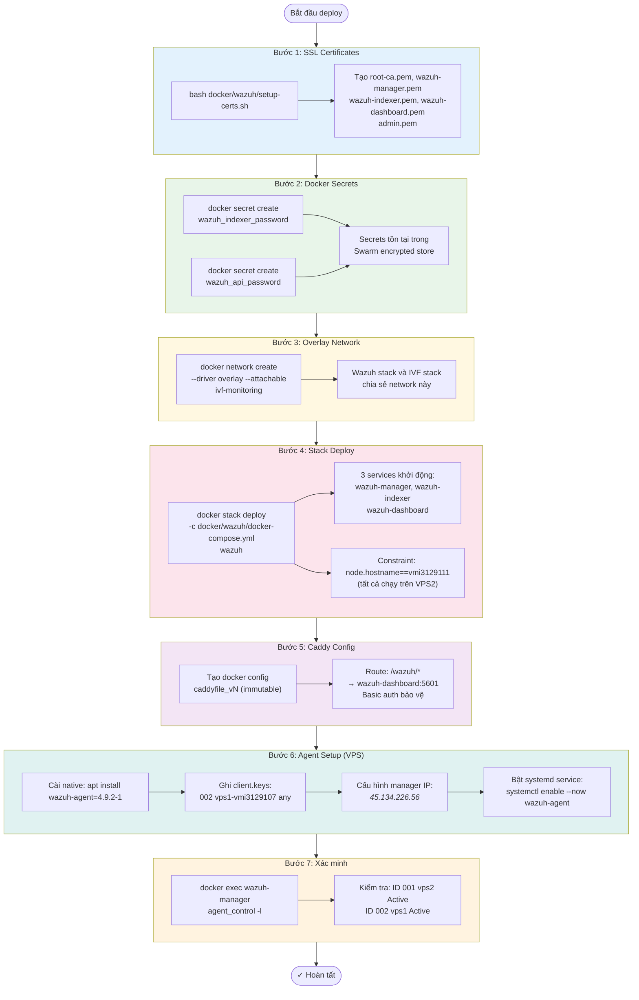

### Lệnh vận hành thường dùng

```bash
# === Kiểm tra trạng thái ===
# Xem tất cả services Wazuh
docker stack ps wazuh

# Xem agents đang kết nối
docker exec wazuh_wazuh-manager.1.<task-id> /var/ossec/bin/agent_control -l

# Xem logs manager real-time
docker service logs -f wazuh_wazuh-manager

# Xem alerts.json (5 alerts gần nhất)
docker exec wazuh_wazuh-manager.1.<task-id> \
  tail -5 /var/ossec/logs/alerts/alerts.json

# === Wazuh API ===
# Lấy JWT token
TOKEN=$(curl -sk -u "wazuh-wui:0TLUTyAWNN5Xk0Gb9aeXdktR2Pp4Ww" \
  -X POST https://localhost:55000/security/user/authenticate \
  | python3 -c "import sys,json; print(json.load(sys.stdin)['data']['token'])")

# Xem agent list
curl -sk -H "Authorization: Bearer $TOKEN" \
  https://localhost:55000/agents?pretty=true

# Xem health check
curl -sk -H "Authorization: Bearer $TOKEN" \
  https://localhost:55000/manager/status?pretty=true

# === API rate limit ===
# Xem cấu hình hiện tại (1500 req/min)
docker exec wazuh_wazuh-manager.1.<task-id> \
  cat /var/ossec/api/configuration/api.yaml
# access:
#   max_request_per_minute: 1500

# === Debug agent connection ===
# Trên VPS1: kiểm tra agent status
systemctl status wazuh-agent
/var/ossec/bin/wazuh-control status
cat /var/ossec/etc/client.keys

# Test kết nối port 1514 tới VPS2
nc -z -w5 45.134.226.56 1514 && echo "PORT OPEN" || echo "PORT BLOCKED"
```

### Cấu hình quan trọng

```
# Wazuh API rate limit — tránh 429 khi dashboard polling
# File: /var/ossec/api/configuration/api.yaml (trong named volume)
access:
  max_request_per_minute: 1500   # default 300 → bị 429 khi Caddy proxy single IP

# Manager disconnect detection
# agents_disconnection_time: 10m  → agent offline 10 phút mới đánh dấu Disconnected

# Alert level threshold
# log_alert_level: 3   → lưu vào alerts.json
# email_alert_level: 12 → gửi email
```

---

## 7. Lynis — Kiến trúc & Luồng audit

### Tổng quan Lynis

**Lynis** là công cụ audit bảo mật hệ thống mã nguồn mở, không cần agent, chạy trực tiếp trên host. Trên IVF Platform, Lynis được triển khai qua **Ansible** và tích hợp với **MinIO** (lưu báo cáo) và **Wazuh** (phân tích log).

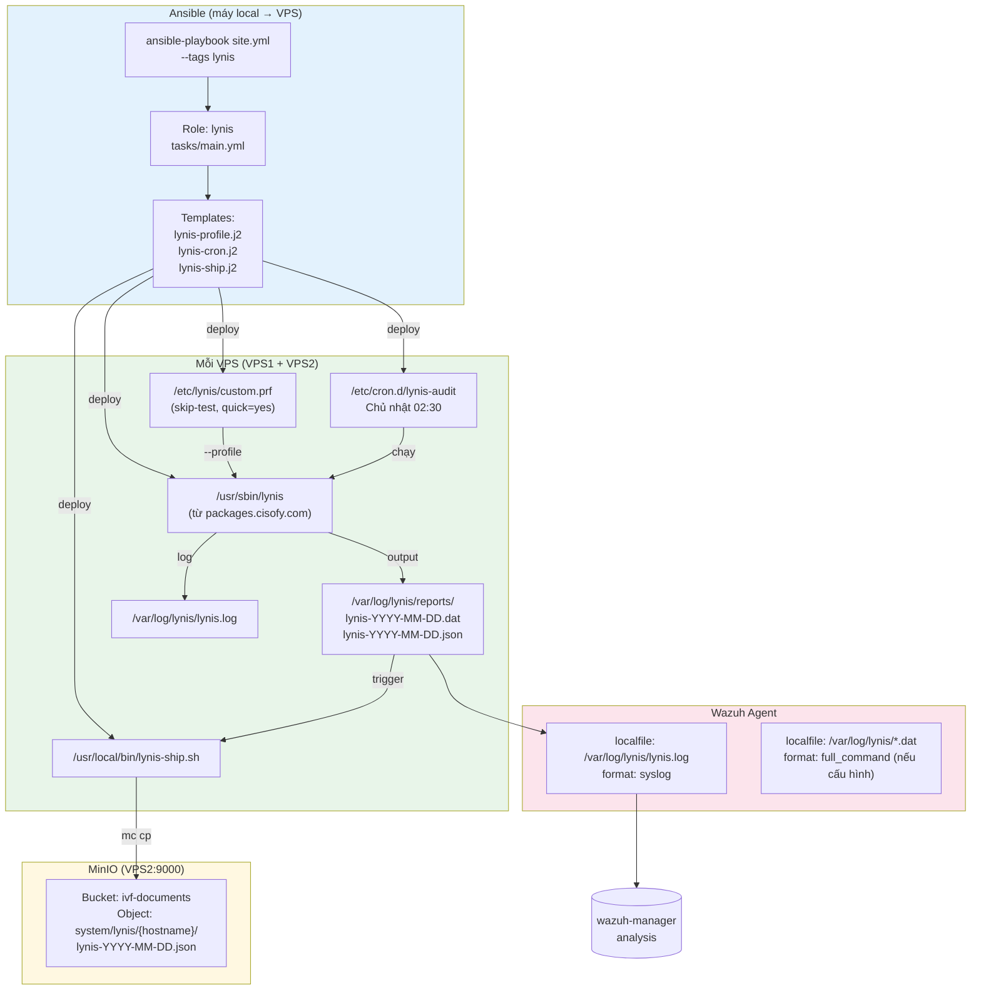

### Luồng Audit chi tiết

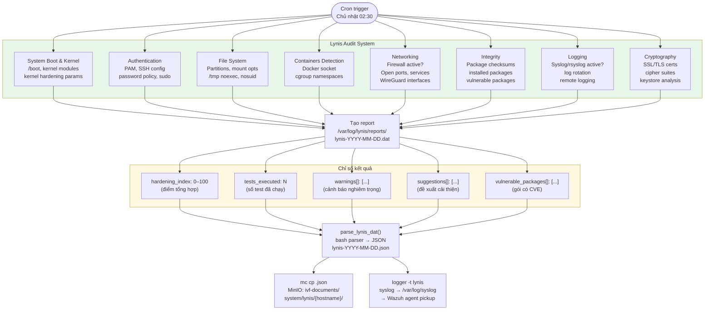

### Custom Profile (`/etc/lynis/custom.prf`)

Template nguồn: `ansible/roles/lynis/templates/lynis-profile.j2`

```ini
#
# Lynis Custom Profile — IVF Platform
# /etc/lynis/custom.prf
#
# Cập nhật: Sau khi áp dụng role hardening (site.yml Phase 1.5),
# chỉ skip các test thực sự KHÔNG áp dụng được cho môi trường VPS/Docker.
# Các test đã được FIX bởi role hardening sẽ không bị skip nữa.
#
# CÁC TEST ĐÃ ĐƯỢC FIX bởi role `hardening` (KHÔNG skip):
#   KRNL-6000, KRNL-5820, SSH-7408, SSH-7412, SSH-7440, SSH-7480
#   AUTH-9286, AUTH-9230, AUTH-9262, FILE-6374, PKGS-7386
#   ACCT-9628, ACCT-9626, MALW-3280, TIME-3104, HRDN-7222(kernel modules)
#   FINT-4350, LOGG-2190, FILE-7524, PKGS-7370, BANN-7126, NETW-3032
#

# ─── Skip tests không áp dụng cho VPS/Docker ───────────────

# BOOT-5122: GRUB password protection — Cloud VPS không có console vật lý
skip-test=BOOT-5122

# CONT-8004: Docker content trust — Dùng GHCR với image signing riêng
skip-test=CONT-8004

# LOGG-2154: Remote syslog — Loki/Promtail đã xử lý log aggregation
skip-test=LOGG-2154

# NETW-3200: Disable IPv6 — Docker/overlay networking cần IPv6
skip-test=NETW-3200

# FIRE-4512: Checks for iptables (UFW đã cấu hình trong role common)
skip-test=FIRE-4512

# DEB-0880: Check apt-show-versions — unattended-upgrades đã xử lý
skip-test=DEB-0880

# ─── Settings ──────────────────────────────────────────────

# Tắt màu để log sạch (Promtail parse)
colors=no

# Không dừng khi có lỗi nhỏ
quick=yes

# Luôn log kết quả test sai OS
log_tests_incorrect_os=yes
```

> **Lưu ý quan trọng**: `HRDN-7222` đã bị xóa khỏi danh sách `skip-test` — test này hiện được xử lý đúng bởi role `hardening` (vô hiệu hóa unused kernel modules). Nếu bạn thấy `HRDN-7222` trong skip list của version trước, đó là phiên bản cũ trước khi chạy Phase 1.5.

### Cron schedule

```
# /etc/cron.d/lynis-audit
# Chạy mỗi Chủ nhật 02:30 sáng (server time)
30 2 * * 0 root \
  lynis audit system \
    --profile /etc/lynis/custom.prf \
    --report-file /var/log/lynis/reports/lynis-$(date +%Y-%m-%d).dat \
    --logfile /var/log/lynis/lynis.log \
    --no-colors --quiet \
  2>&1 | logger -t lynis \
  && /usr/local/bin/lynis-ship.sh 2>&1 | logger -t lynis-ship

# Retention: xóa reports cũ hơn 90 ngày
0 3 * * 0 root find /var/log/lynis/reports -name "*.dat" -mtime +90 -delete
0 3 * * 0 root find /var/log/lynis/reports -name "*.json" -mtime +90 -delete
```

---

## 8. Lynis — Tích hợp Wazuh & MinIO

### Luồng upload MinIO

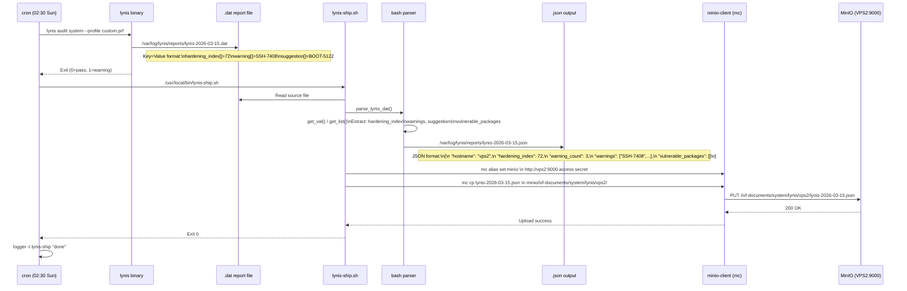

### JSON output format

```json
{
  "hostname": "vmi3129111",
  "report_date": "2026-03-15",
  "generated_at": "2026-03-15T02:45:18Z",
  "lynis_version": "3.1.1",
  "os": "Ubuntu 24.04.1 LTS",
  "kernel": "6.8.0-51-generic",
  "hardening_index": 72,
  "tests_executed": 247,
  "firewall_active": "yes",
  "malware_scanner": "",
  "compiler_installed": "no",
  "warning_count": 3,
  "warnings": ["SSH-7408", "AUTH-9328", "LOGG-2154"],
  "suggestion_count": 18,
  "suggestions": ["BOOT-5122", "KRNL-6000", "..."],
  "vulnerable_packages": [],
  "source_file": "/var/log/lynis/reports/lynis-2026-03-15.dat"
}
```

### Wazuh integration — đọc log Lynis

Wazuh agent trên mỗi VPS thu thập log Lynis qua syslog (logger output của cron):

```xml
<!-- Agent config: ossec.conf — không cần cấu hình thêm -->
<!-- lynis output qua logger đi vào /var/log/syslog -->
<localfile>
  <log_format>syslog</log_format>
  <location>/var/log/syslog</location>
</localfile>
```

**Rule gợi ý thêm trong `docker_swarm_rules.xml`** để parse Lynis alerts:

```xml
<!-- Lynis hardening index thấp -->
<rule id="100200" level="7">
  <if_group>syslog</if_group>
  <match>lynis</match>
  <description>Lynis audit completed on $(hostname)</description>
  <group>lynis,security-audit</group>
</rule>
```

---

## 9. Tích hợp tổng thể Wazuh + Lynis

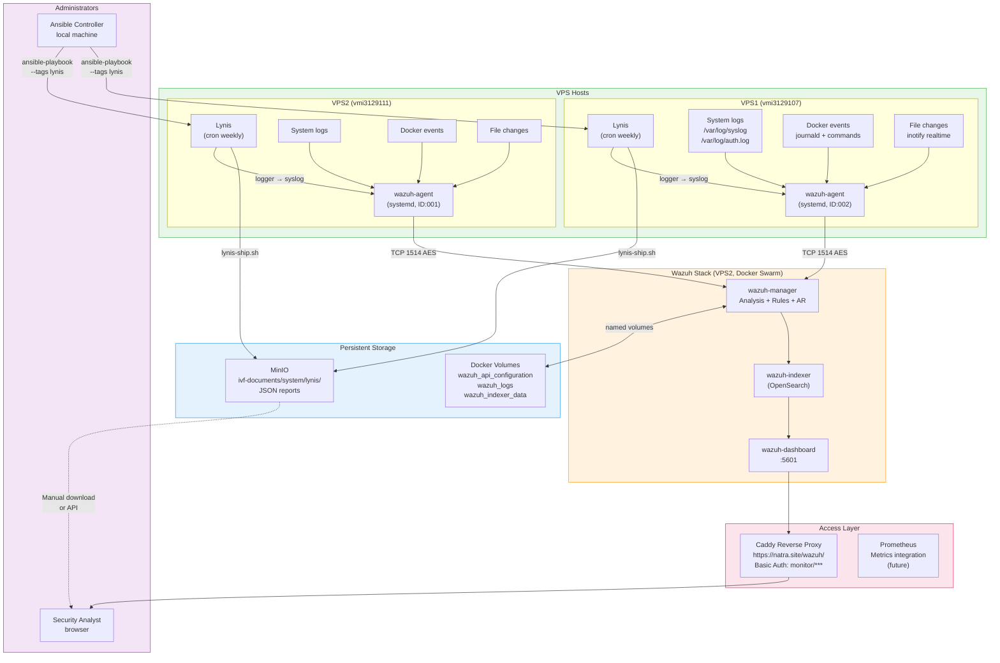

### Bảng tích hợp tổng hợp

| Công cụ                  | Loại         | Tần suất             | Dữ liệu                       | Lưu trữ          |
| ------------------------ | ------------ | -------------------- | ----------------------------- | ---------------- |
| **Wazuh Agent**          | Real-time    | Liên tục (1s events) | System logs, FIM, Docker      | OpenSearch index |
| **Wazuh SCA**            | Periodic     | 12h                  | Security configuration        | OpenSearch index |
| **Wazuh Rootcheck**      | Periodic     | 12h                  | Trojans, PIDs, ports          | OpenSearch index |
| **Wazuh Syscollector**   | Periodic     | 1h                   | HW/OS/Packages inventory      | OpenSearch index |
| **Wazuh Docker Monitor** | Periodic     | 60–600s              | Container/Service/Node status | OpenSearch index |
| **Lynis**                | Scheduled    | Weekly (Sun 02:30)   | Full security audit           | MinIO + syslog   |
| **FIM (realtime)**       | Event-driven | Immediate            | File changes /etc /opt/ivf    | OpenSearch index |

---

## 10. Hardening Ansible Role — Nâng cao Lynis Score

### Tổng quan

Role `hardening` được tạo để **tự động hóa việc fix tất cả Lynis warnings/suggestions** có thể xử lý bằng cấu hình hệ thống. Role này chạy trong **Phase 1.5** của `site.yml`, sau `common` và trước `docker`.

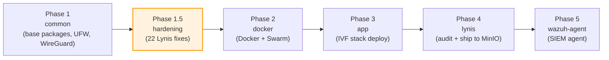

### Cấu trúc role

```
ansible/roles/hardening/
├── defaults/
│   └── main.yml          # Toggle variables (aide, rkhunter, auditd, usb)
├── handlers/
│   └── main.yml          # restart sshd/auditd/sysstat/timesyncd
└── tasks/
    └── main.yml          # 22 task groups, tagged by Lynis test ID
```

### Bảng các Lynis test được fix

| Lynis Test ID     | Mô tả vấn đề                            | Giải pháp trong role                                                                   |
| ----------------- | --------------------------------------- | -------------------------------------------------------------------------------------- |
| **KRNL-6000**     | Kernel sysctl chưa hardened             | `/etc/sysctl.d/99-hardening.conf` — 20+ kernel params                                  |
| **KRNL-5820**     | Core dumps không bị hạn chế             | `limits.d/99-no-coredump.conf` + `systemd coredump.conf.d`                             |
| **SSH-7408**      | TCP forwarding enabled                  | `AllowTcpForwarding no` trong sshd_config                                              |
| **SSH-7412**      | MaxAuthTries quá cao                    | `MaxAuthTries 3`                                                                       |
| **SSH-7440**      | Agent forwarding enabled                | `AllowAgentForwarding no`                                                              |
| **SSH-7480**      | LogLevel không phải VERBOSE             | `LogLevel VERBOSE`                                                                     |
| **SSH-7490/7498** | Không có timeout SSH session            | `ClientAliveInterval 300`, `ClientAliveCountMax 2`                                     |
| **AUTH-9286**     | umask tại login.defs quá rộng           | `UMASK 027` trong `/etc/login.defs`                                                    |
| **FILE-6430**     | umask mặc định 022 (không bảo mật)      | `UMASK 027` (cùng task AUTH-9286)                                                      |
| **AUTH-9230**     | Password expiry chưa cấu hình           | `PASS_MAX_DAYS 90`, `PASS_MIN_DAYS 1`, `PASS_WARN_AGE 14`                              |
| **AUTH-9262**     | PAM password quality không được enforce | `libpam-pwquality` + `pwquality.conf` (minlen=12, minclass=3)                          |
| **FILE-6374**     | `/tmp` mount thiếu nodev/nosuid         | `tmpfs /tmp nodev,nosuid,size=1G` ⚠️ _noexec bỏ chủ ý (Docker cần)_                    |
| **PKGS-7386**     | Không có audit daemon                   | `auditd` + rules tại `/etc/audit/rules.d/99-ivf.rules`                                 |
| **ACCT-9628**     | sysstat chưa cài                        | `sysstat` package + enable collection                                                  |
| **ACCT-9626**     | Process accounting chưa bật             | `acct` package + `accton /var/log/account/pacct`                                       |
| **MALW-3280**     | Không có malware scanner                | `rkhunter` + DB update + weekly cron                                                   |
| **TIME-3104**     | NTP không được cấu hình rõ ràng         | `systemd-timesyncd` + `pool.ntp.org`                                                   |
| **HRDN-7222**     | Unused kernel modules vẫn loadable      | `/etc/modprobe.d/disable-filesystems.conf` _(squashfs giữ lại!)_                       |
| **NETW-3032**     | Unused network protocols enabled        | `/etc/modprobe.d/disable-protocols.conf` (dccp/sctp/rds/tipc)                          |
| **FINT-4350**     | Không có file integrity tool (AIDE)     | `aide` + `/etc/aide/aide.conf` + daily cron + init DB                                  |
| **LOGG-2190**     | Log rotation chưa tối ưu                | logrotate 13 tuần cho auth.log/syslog/kern.log                                         |
| **FILE-7524**     | Quyền file hệ thống sai                 | Fix permissions: cron.d (0700), shadow (0640), passwd (0644)                           |
| **PKGS-7370**     | Chưa có auto security updates           | `unattended-upgrades` + `20auto-upgrades` config                                       |
| **BANN-7126**     | Không có login warning banner           | `/etc/issue.net` banner + SSH Banner directive + `/etc/motd`                           |
| **USB-1000**      | USB storage module còn active (VPS)     | `/etc/modprobe.d/disable-usb-storage.conf` (khi `hardening_disable_usb_storage: true`) |

### ⚠️ Lưu ý quan trọng khi hardening với Docker

| Vấn đề                          | Chi tiết                                                                                                |
| ------------------------------- | ------------------------------------------------------------------------------------------------------- |
| `/tmp` **không** có `noexec`    | Docker containers cần exec quyền trên `/tmp`. Role đặt `nodev,nosuid,size=1G` nhưng **không** `noexec`. |
| `squashfs` **không** bị disable | Docker overlay2 driver yêu cầu `squashfs`. Chỉ disable các FS: cramfs, hfs, hfsplus, jffs2, udf.        |
| `AIDE` khởi tạo tốn thời gian   | `aideinit --yes` chạy async với timeout 300s. Sau khoảng 5 phút mới xong lần đầu.                       |
| `auditd` quy tắc `-e 2`         | Mode immutable — sau khi load rules, cần reboot để thay đổi rules. Phù hợp production.                  |

### Chạy Hardening qua Ansible

```bash
# Chạy lần đầu trên tất cả VPS (bao gồm hardening)
ansible-playbook -i ansible/hosts.yml ansible/site.yml --tags setup,hardening

# Chạy hardening-only (cập nhật lại sau khi sửa role)
ansible-playbook -i ansible/hosts.yml ansible/site.yml --tags hardening

# Chỉ chạy trên VPS1
ansible-playbook -i ansible/hosts.yml ansible/site.yml --tags hardening --limit vps1

# Dry-run (check mode, không thay đổi hệ thống)
ansible-playbook -i ansible/hosts.yml ansible/site.yml --tags hardening --check --diff
```

### Variables có thể override

File `ansible/roles/hardening/defaults/main.yml`:

```yaml
# Bật/tắt cài đặt các tool nặng
hardening_install_aide: true # AIDE file integrity (tốn ~200MB)
hardening_install_rkhunter: true # rkhunter malware scanner
hardening_install_auditd: true # auditd daemon
hardening_tmp_nodev_nosuid: true # Mount /tmp với nodev,nosuid
hardening_disable_usb_storage: true # Disable USB storage module (VPS = true)
```

Override trong `ansible/hosts.yml` hoặc `group_vars/`:

```yaml
# Ví dụ: tắt AIDE nếu có giới hạn storage
hardening_install_aide: false
```

### Quy trình kiểm tra kết quả sau hardening

```bash
# Bước 1: Chạy Lynis manual sau khi hardening xong
ssh root@VPS1 "lynis audit system --profile /etc/lynis/custom.prf --quiet 2>&1 | tail -30"

# Bước 2: Xem hardening index mới
ssh root@VPS1 "grep 'hardening_index' /var/log/lynis/reports/lynis-\$(date +%Y-%m-%d).dat"

# Bước 3: Xem danh sách warnings còn lại (nên = 0 sau hardening)
ssh root@VPS1 "grep '^warning\[\]=' /var/log/lynis/reports/lynis-\$(date +%Y-%m-%d).dat"

# Bước 4: Xem suggestions còn lại (chỉ còn BOOT-5122 và các skip-test)
ssh root@VPS1 "grep '^suggestion\[\]=' /var/log/lynis/reports/lynis-\$(date +%Y-%m-%d).dat"

# Bước 5: Kiểm tra AIDE đã init chưa
ssh root@VPS1 "stat /var/lib/aide/aide.db 2>/dev/null && echo 'AIDE DB OK' || echo 'AIDE DB MISSING'"

# Bước 6: Kiểm tra auditd đang chạy
ssh root@VPS1 "systemctl is-active auditd && auditctl -l | head -5"

# Bước 7: Kiểm tra SSH config đúng
ssh root@VPS1 "sshd -T | grep -E 'allowtcpforwarding|maxauthtries|loglevel|clientaliveinterval'"
```

### Điểm hardening_index kỳ vọng

| Trạng thái                           | Điểm (ước tính) | Ghi chú                                   |
| ------------------------------------ | --------------- | ----------------------------------------- |
| Default Ubuntu 24.04 (chưa hardened) | 55–65           | Baseline trước khi apply role             |
| Sau Phase 1 (common + UFW)           | 60–68           | UFW active, basic packages                |
| **Sau Phase 1.5 (hardening)**        | **78–88**       | Target score sau khi apply role hardening |
| Skip tests skip lý do hợp lệ         | ~83–90+         | Sau khi `skip-test` loại bỏ N/A tests     |

> **Lưu ý**: Điểm chính xác phụ thuộc vào Lynis version và số lượng test áp dụng được. Tests bị skip (`BOOT-5122`, `CONT-8004`, v.v.) không tính vào điểm, nhưng giúp báo cáo sạch hơn.

### Workflow tổng thể Lynis CI cycle

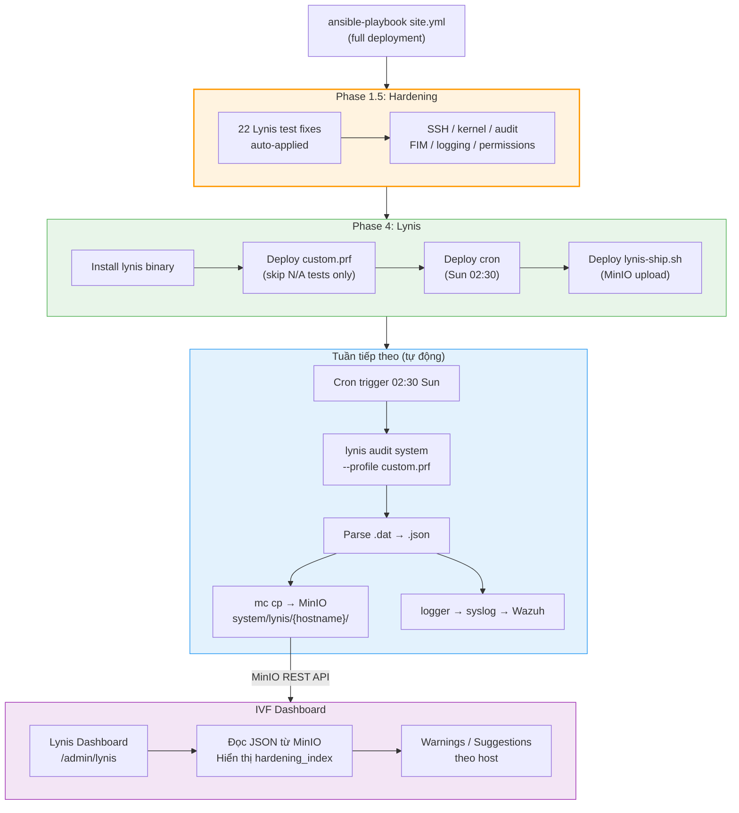

### Audit rules chi tiết (`/etc/audit/rules.d/99-ivf.rules`)

```bash
# Theo dõi thay đổi user/group
-w /etc/passwd     -p wa  -k user-changes
-w /etc/shadow     -p wa  -k user-changes
-w /etc/group      -p wa  -k user-changes
-w /etc/gshadow    -p wa  -k user-changes

# Theo dõi privilege escalation
-w /etc/sudoers    -p wa  -k privilege-escalation
-w /etc/sudoers.d/ -p wa  -k privilege-escalation

# Theo dõi SSH config
-w /etc/ssh/sshd_config -p wa -k ssh-config

# Theo dõi auth logs
-w /var/log/auth.log    -p wa  -k auth-log
-w /var/log/faillog     -p wa  -k auth-log

# Theo dõi Docker config (tích hợp với Wazuh rule 100160)
-w /etc/docker/ -p wa  -k docker-config
-w /usr/bin/docker -p x -k docker-exec

# Buffer size và immutable mode sau reboot
-b 8192
-e 2
```

> Các rule `docker-config` và `docker-exec` tích hợp trực tiếp với Wazuh rules **100160** và **100161** — mọi thay đổi `/etc/docker/` sẽ tạo alert level 10+.

### Troubleshooting Hardening

| Vấn đề                           | Lệnh kiểm tra                                         | Giải pháp                                                   |
| -------------------------------- | ----------------------------------------------------- | ----------------------------------------------------------- |
| `sysctl` task fail (permission)  | `dmesg \| grep sysctl`                                | VPS bị giới hạn namespace — `ignore_errors: true` đã set    |
| AIDE init chạy lâu > 5 phút      | `ps aux \| grep aide`                                 | Bình thường — `async: 300 poll: 10`. Kiểm tra sau ~5 phút   |
| auditd rules không load          | `auditctl -l` (nếu rỗng: `augenrules --load`)         | Restart: `systemctl restart auditd`                         |
| SSH bị lock sau khi hardening    | Local console hoặc VPS panel                          | Kiểm tra `sshd_config` syntax: `sshd -t` trước khi apply    |
| `/tmp` size=1G vẫn tràn          | `df -h /tmp`                                          | Tăng size trong role: `opts: defaults,nodev,nosuid,size=2G` |
| rkhunter false positive cảnh báo | `rkhunter --check --nocolors 2>&1 \| grep -i warning` | Chạy `rkhunter --propupd` sau khi cập nhật packages         |

---

## 11. Tham chiếu: Ports, Credentials, Rule IDs

### Ports Wazuh

| Port      | Protocol | Dịch vụ         | Mô tả                                           |
| --------- | -------- | --------------- | ----------------------------------------------- |
| **1514**  | TCP      | wazuh-manager   | Agent event communication (encrypted AES)       |
| **1515**  | TCP      | wazuh-manager   | Agent enrollment                                |
| **1516**  | TCP      | wazuh-manager   | Cluster communication (internal)                |
| **55000** | TCP      | wazuh-manager   | REST API (internal only, không expose ra ngoài) |
| **9200**  | TCP      | wazuh-indexer   | OpenSearch HTTP (internal)                      |
| **9300**  | TCP      | wazuh-indexer   | OpenSearch transport (internal)                 |
| **5601**  | TCP      | wazuh-dashboard | Web UI (qua Caddy proxy)                        |

### Credentials

| Dịch vụ              | User         | Password                           | Ghi chú                         |
| -------------------- | ------------ | ---------------------------------- | ------------------------------- |
| Wazuh Dashboard      | `admin`      | `NXPPTSMdDcOAC9AzlhfNxN0ZYVrOpW1g` | OpenSearch admin                |
| Wazuh API            | `wazuh-wui`  | `0TLUTyAWNN5Xk0Gb9aeXdktR2Pp4Ww`   | API user                        |
| Caddy Basic Auth     | `monitor`    | `wDDaI8zzSTBPyzfGp3wRc6JkDGgIv6ZF` | HTTPS proxy auth                |
| MinIO (Lynis upload) | `minioadmin` | `minioadmin123`                    | S3 API (ghi đè trong hosts.yml) |

> ⚠️ **Bảo mật**: Thay đổi tất cả credentials trong môi trường production. MinIO credentials nên được ghi đè trong `ansible/hosts.yml` hoặc `group_vars/all.yml`.

### Agent IDs

| ID  | Name            | VPS  | IP        | Status                |
| --- | --------------- | ---- | --------- | --------------------- |
| 000 | wazuh-manager   | VPS2 | 127.0.0.1 | Active/Local (server) |
| 001 | vps2-vmi3129111 | VPS2 | any       | Active ✅             |
| 002 | vps1-vmi3129107 | VPS1 | any       | Active ✅             |

### Lynis paths

| Path                                            | Mô tả               |
| ----------------------------------------------- | ------------------- |
| `/usr/sbin/lynis`                               | Binary              |
| `/etc/lynis/custom.prf`                         | Custom profile      |
| `/var/log/lynis/lynis.log`                      | Audit log           |
| `/var/log/lynis/reports/lynis-YYYY-MM-DD.dat`   | Raw report          |
| `/var/log/lynis/reports/lynis-YYYY-MM-DD.json`  | Parsed JSON         |
| `/usr/local/bin/lynis-ship.sh`                  | MinIO upload script |
| `/etc/cron.d/lynis-audit`                       | Cron definition     |
| `MinIO: ivf-documents/system/lynis/{hostname}/` | Remote storage      |

### Hardening paths

| Path                                         | Mô tả                    |
| -------------------------------------------- | ------------------------ |
| `/etc/sysctl.d/99-hardening.conf`            | Kernel sysctl params     |
| `/etc/security/limits.d/99-no-coredump.conf` | Core dump limits         |
| `/etc/systemd/coredump.conf.d/disable.conf`  | Systemd coredump disable |
| `/etc/ssh/sshd_config`                       | SSH hardening config     |
| `/etc/audit/rules.d/99-ivf.rules`            | Audit rules              |
| `/etc/security/pwquality.conf`               | Password complexity      |
| `/etc/modprobe.d/disable-filesystems.conf`   | Disabled FS modules      |
| `/etc/modprobe.d/disable-protocols.conf`     | Disabled network modules |
| `/etc/modprobe.d/disable-usb-storage.conf`   | Disabled USB storage     |
| `/etc/aide/aide.conf`                        | AIDE config              |
| `/var/lib/aide/aide.db`                      | AIDE baseline database   |
| `/etc/cron.d/aide-daily`                     | AIDE daily check cron    |
| `/etc/cron.d/rkhunter-weekly`                | rkhunter weekly cron     |
| `/etc/issue.net`                             | SSH login banner         |
| `/etc/apt/apt.conf.d/50unattended-upgrades`  | Auto security updates    |

### Chạy Lynis thủ công

```bash
# Audit toàn hệ thống với custom profile
lynis audit system \
  --profile /etc/lynis/custom.prf \
  --report-file /var/log/lynis/reports/lynis-manual.dat \
  --logfile /var/log/lynis/lynis.log \
  --no-colors

# Xem hardening index ngay sau khi chạy
grep "hardening_index" /var/log/lynis/reports/lynis-manual.dat

# Upload thủ công lên MinIO
/usr/local/bin/lynis-ship.sh

# Xem warnings trong report
grep "^warning\[\]=" /var/log/lynis/reports/lynis-$(date +%Y-%m-%d).dat

# Deploy lại Lynis qua Ansible
ansible-playbook ansible/site.yml --tags lynis -i ansible/hosts.yml

# Deploy hardening + lynis cùng lúc
ansible-playbook ansible/site.yml --tags hardening,lynis -i ansible/hosts.yml
```

### Troubleshooting

| Vấn đề                          | Kiểm tra                                             | Giải pháp                                                      |
| ------------------------------- | ---------------------------------------------------- | -------------------------------------------------------------- |
| Agent `Never connected`         | `agent_control -l` trên manager                      | Kiểm tra port 1514 từ agent tới manager; xem `client.keys`     |
| Agent `Disconnected`            | `systemctl status wazuh-agent`                       | `systemctl start wazuh-agent`; xem `/var/ossec/logs/ossec.log` |
| Dashboard 429 Too Many Requests | `cat /var/ossec/api/configuration/api.yaml`          | Tăng `max_request_per_minute: 1500`                            |
| Lynis ship fail                 | `journalctl -t lynis-ship`                           | Kiểm tra MinIO access key; `mc ping minio`                     |
| FIM false positives nhiều       | `wazuh-dashboard → Integrity Monitoring`             | Thêm `<ignore>` vào ossec.conf                                 |
| Custom rules không hoạt động    | `agent_control -m 1 -f docker-swarm-services` (test) | Kiểm tra XML syntax; `ossec-logtest` trên manager              |

---

_Tài liệu được tạo: 2026-03-15 | Cập nhật: 2026-03-16 | Version: 2.0 | IVF Platform Security Infrastructure_
