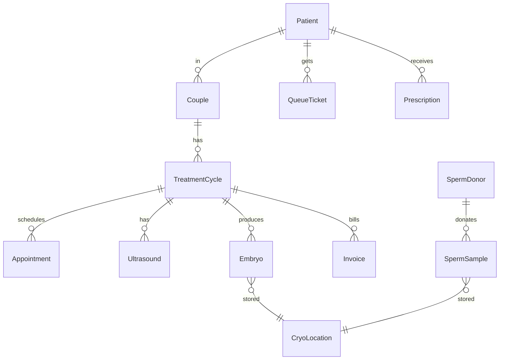

# IVF Information System - Implementation Plan v2.0

## Executive Summary

Build a comprehensive **IVF Information System (IVF-IS)** to digitize 26 clinical workflows across 12 departments at a fertility clinic. The system replaces paper-based processes with real-time digital tracking.

---

## Technology Stack

| Component | Technology |
|-----------|------------|
| **Backend** | .NET 10 Web API |
| **Frontend** | Angular 17 + PrimeNG |
| **Database** | PostgreSQL 16 |
| **Real-time** | SignalR |
| **Auth** | JWT + Identity |
| **ORM** | Entity Framework Core 10 + Npgsql |

---

## Project Structure

```
d:\Pr.Net\IVF\
├── src/
│   ├── IVF.Domain/              # Entities, Enums, Interfaces
│   │   ├── Entities/
│   │   ├── Enums/
│   │   └── Interfaces/
│   ├── IVF.Application/         # CQRS, Business Logic
│   │   ├── Features/
│   │   │   ├── Patients/
│   │   │   ├── Cycles/
│   │   │   ├── Queue/
│   │   │   ├── Lab/
│   │   │   ├── Andrology/
│   │   │   ├── SpermBank/
│   │   │   ├── Billing/
│   │   │   └── Reports/
│   │   └── Common/
│   ├── IVF.Infrastructure/      # EF, External Services
│   │   ├── Persistence/
│   │   └── Services/
│   ├── IVF.API/                 # Controllers, Hubs
│   │   ├── Controllers/
│   │   ├── Hubs/
│   │   └── Middleware/
│   └── IVF.Web/                 # Angular Frontend
│       ├── src/app/
│       │   ├── modules/
│       │   │   ├── reception/
│       │   │   ├── consultation/
│       │   │   ├── ultrasound/
│       │   │   ├── lab/
│       │   │   ├── andrology/
│       │   │   ├── sperm-bank/
│       │   │   ├── billing/
│       │   │   └── admin/
│       │   ├── shared/
│       │   └── core/
│       └── assets/
├── tests/
│   ├── IVF.UnitTests/
│   └── IVF.IntegrationTests/
└── docs/
```

---

## Core Entities

### Patient & Couple

```csharp
public class Patient
{
    public Guid Id { get; set; }
    public string PatientCode { get; set; }      // Mã BN
    public string FullName { get; set; }
    public DateTime DateOfBirth { get; set; }
    public Gender Gender { get; set; }
    public string IdentityNumber { get; set; }   // CCCD/CMND
    public string Phone { get; set; }
    public string Address { get; set; }
    public byte[]? Photo { get; set; }
    public byte[]? Fingerprint { get; set; }
    public PatientType Type { get; set; }        // Infertility, EggDonor, SpermDonor
    public DateTime CreatedAt { get; set; }
}

public class Couple
{
    public Guid Id { get; set; }
    public Guid WifeId { get; set; }
    public Guid HusbandId { get; set; }
    public Guid? SpermDonorId { get; set; }      // For NHTT cases
    public DateTime MarriageDate { get; set; }
    public int InfertilityYears { get; set; }
}
```

### Treatment Cycle

```csharp
public class TreatmentCycle
{
    public Guid Id { get; set; }
    public Guid CoupleId { get; set; }
    public string CycleCode { get; set; }
    public TreatmentMethod Method { get; set; }   // QHTN, IUI, ICSI, IVM
    public CyclePhase CurrentPhase { get; set; }
    public DateTime StartDate { get; set; }
    public DateTime? EndDate { get; set; }
    public CycleOutcome? Outcome { get; set; }
}

public enum CyclePhase
{
    Consultation,        // Tư vấn
    OvarianStimulation,  // KTBT
    TriggerShot,         // Tiêm thuốc rụng trứng
    EggRetrieval,        // Chọc hút
    EmbryoCulture,       // Nuôi phôi
    EmbryoTransfer,      // Chuyển phôi
    LutealSupport,       // Hỗ trợ hoàng thể
    PregnancyTest,       // Thử thai
    Monitoring,          // Theo dõi thai
    Completed
}
```

### Queue Management

```csharp
public class QueueTicket
{
    public Guid Id { get; set; }
    public string TicketNumber { get; set; }     // SA-001, TV-015
    public QueueType Type { get; set; }
    public Guid PatientId { get; set; }
    public Guid? CycleId { get; set; }
    public string DepartmentCode { get; set; }
    public TicketStatus Status { get; set; }
    public DateTime IssuedAt { get; set; }
    public DateTime? CalledAt { get; set; }
    public DateTime? CompletedAt { get; set; }
    public Guid? CalledByUserId { get; set; }
}
```

### Embryo & Cryo Storage

```csharp
public class Embryo
{
    public Guid Id { get; set; }
    public Guid CycleId { get; set; }
    public int Number { get; set; }
    public EmbryoGrade Grade { get; set; }       // A, B, C, D
    public EmbryoDay Day { get; set; }           // D3, D5, D6
    public EmbryoStatus Status { get; set; }
    public Guid? CryoLocationId { get; set; }
    public DateTime CreatedAt { get; set; }
}

public class CryoLocation
{
    public Guid Id { get; set; }
    public string Tank { get; set; }
    public string Canister { get; set; }
    public string Cane { get; set; }
    public string Goblet { get; set; }
    public string Straw { get; set; }
}
```

---

## API Endpoints

### Patients

| Method | Endpoint | Description |
|--------|----------|-------------|
| POST | `/api/patients` | Register new patient |
| GET | `/api/patients/{id}` | Get patient details |
| GET | `/api/patients/search?q={term}` | Search patients |
| POST | `/api/couples` | Link couple |
| GET | `/api/couples/{id}/cycles` | Get treatment history |

### Queue

| Method | Endpoint | Description |
|--------|----------|-------------|
| POST | `/api/queue/tickets` | Issue new ticket |
| GET | `/api/queue/department/{code}` | Get department queue |
| PUT | `/api/queue/tickets/{id}/call` | Call patient |
| PUT | `/api/queue/tickets/{id}/complete` | Complete service |
| WS | `/hubs/queue` | Real-time updates |

### Cycles

| Method | Endpoint | Description |
|--------|----------|-------------|
| POST | `/api/cycles` | Start new cycle |
| GET | `/api/cycles/{id}` | Get cycle details |
| PUT | `/api/cycles/{id}/phase` | Update phase |
| POST | `/api/cycles/{id}/ultrasound` | Record ultrasound |
| POST | `/api/cycles/{id}/embryos` | Record embryos |

### Lab & Andrology

| Method | Endpoint | Description |
|--------|----------|-------------|
| POST | `/api/semen-analysis` | Record semen analysis |
| POST | `/api/sperm-bank/donors` | Register donor |
| POST | `/api/sperm-bank/samples` | Record sample |
| GET | `/api/sperm-bank/inventory` | Get available samples |

### Billing

| Method | Endpoint | Description |
|--------|----------|-------------|
| POST | `/api/invoices` | Create invoice |
| POST | `/api/invoices/{id}/pay` | Record payment |
| POST | `/api/invoices/{id}/refund` | Process refund |

---

## UI Modules

### 1. Reception Dashboard (`/reception`)
- Patient registration form
- Queue ticket issuance
- Payment collection
- Real-time queue display

### 2. Consultation (`/consultation`)
- Patient history view
- Treatment recommendations
- Prescription entry
- Appointment scheduling

### 3. Ultrasound (`/ultrasound`)
- Queue caller
- Follicle monitoring form
- Measurement recording
- Auto-calculation of follicle counts

### 4. Lab Dashboard (`/lab`)
- Embryo tracking board
- Daily embryo report
- Cryopreservation management
- Transfer scheduling

### 5. Andrology (`/andrology`)
- Semen analysis entry
- Sperm washing results
- Donor screening status

### 6. Sperm Bank (`/sperm-bank`)
- Donor registry
- Sample inventory
- Matching (donor → couples)
- HIV retest tracking

### 7. Pharmacy (`/pharmacy`)
- Prescription queue
- Drug dispensing
- Inventory alerts

### 8. Reports (`/reports`)
- Success rates dashboard
- Financial summary
- Workload analytics
- Cryo inventory status

---

## Database Diagram



---

## Implementation Phases

### Phase 1: Core Foundation (4 weeks)
- [x] Project setup with Clean Architecture
- [ ] Patient management CRUD
- [ ] User authentication (RBAC)
- [ ] Basic queue system

### Phase 2: Clinical Workflows (6 weeks)
- [ ] Treatment cycle tracking
- [ ] Ultrasound recording
- [ ] Consultation workflow
- [ ] Prescription management

### Phase 3: Lab & Procedures (6 weeks)
- [ ] Egg retrieval workflow
- [ ] Embryo tracking
- [ ] Cryopreservation
- [ ] IUI procedure

### Phase 4: Andrology & Sperm Bank (4 weeks)
- [ ] Semen analysis
- [ ] Donor management
- [ ] NHTT workflows

### Phase 5: Billing & Reports (4 weeks)
- [ ] Invoice management
- [ ] Payment tracking
- [ ] Analytics dashboard

---

## Development Commands

```bash
# Create solution
dotnet new sln -n IVF

# Create projects
dotnet new classlib -n IVF.Domain -o src/IVF.Domain
dotnet new classlib -n IVF.Application -o src/IVF.Application
dotnet new classlib -n IVF.Infrastructure -o src/IVF.Infrastructure
dotnet new webapi -n IVF.API -o src/IVF.API

# Add to solution
dotnet sln add src/IVF.Domain
dotnet sln add src/IVF.Application
dotnet sln add src/IVF.Infrastructure
dotnet sln add src/IVF.API

# Create Angular frontend
cd src
npx -y @angular/cli@17 new IVF.Web --routing --style=scss
```

---

## Vietnamese Terminology Reference

| English | Vietnamese | Code |
|---------|------------|------|
| Ovarian Stimulation | Kích thích buồng trứng | KTBT |
| Trigger Shot | Tiêm thuốc rụng trứng | KTRT |
| Egg Retrieval | Chọc hút | ChocHut |
| Embryo Transfer | Chuyển phôi | ChuyenPhoi |
| Frozen Transfer | Chuyển phôi trữ | CPT |
| Pregnancy Test | Thử thai | ThuThai |
| Sperm Bank | Ngân hàng tinh trùng | NHTT |
| Semen Analysis | Tinh dịch đồ | TDD |
| Queue Ticket | Số thứ tự | STT |
| Consultation | Tư vấn | TuVan |
