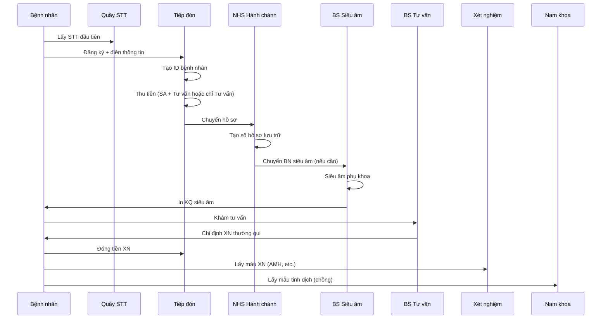
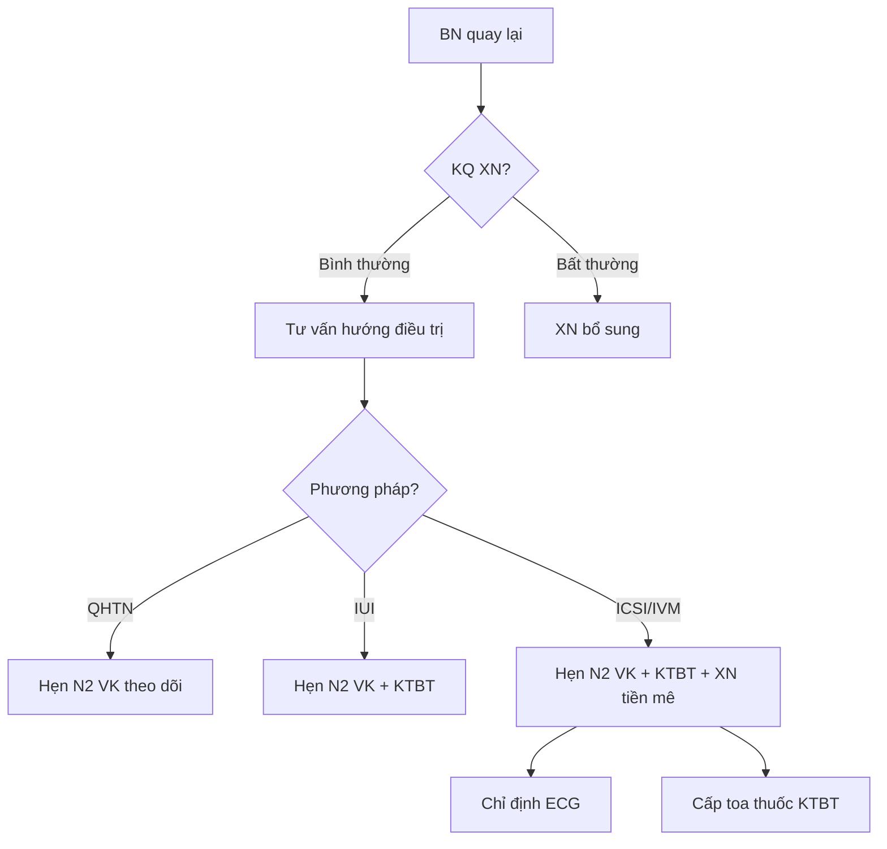
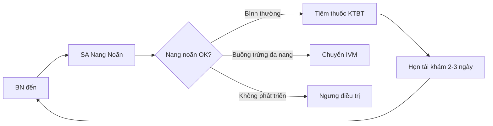
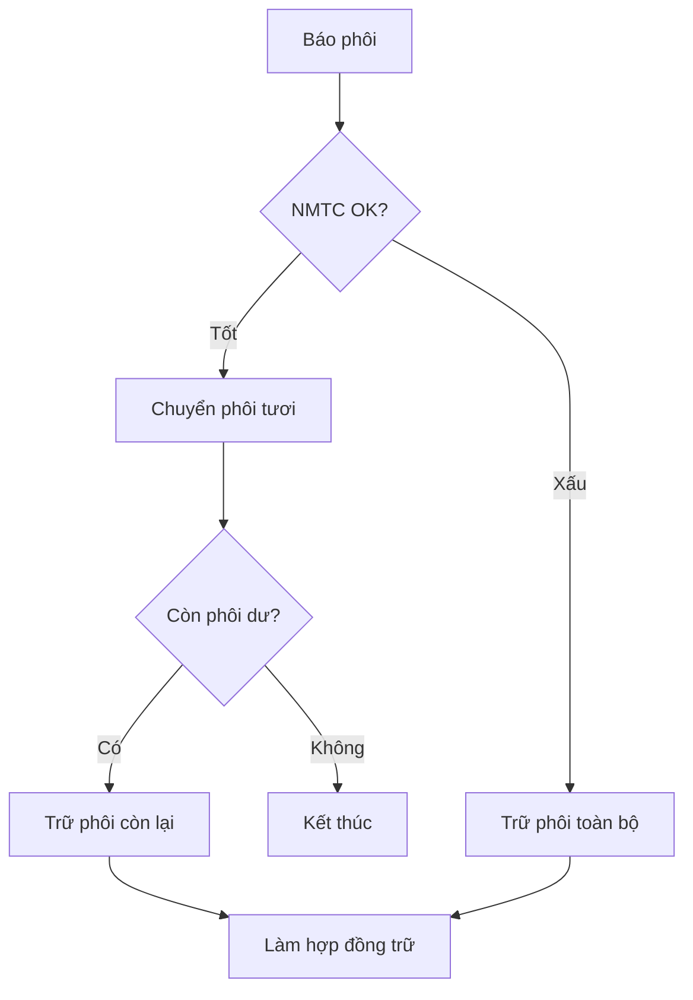
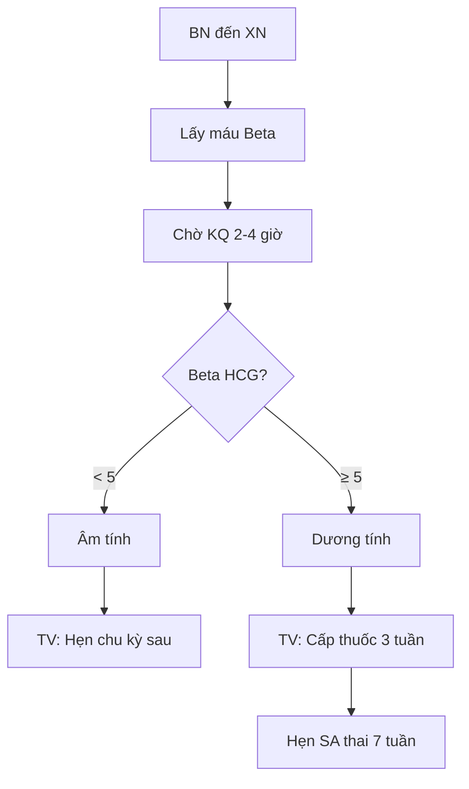
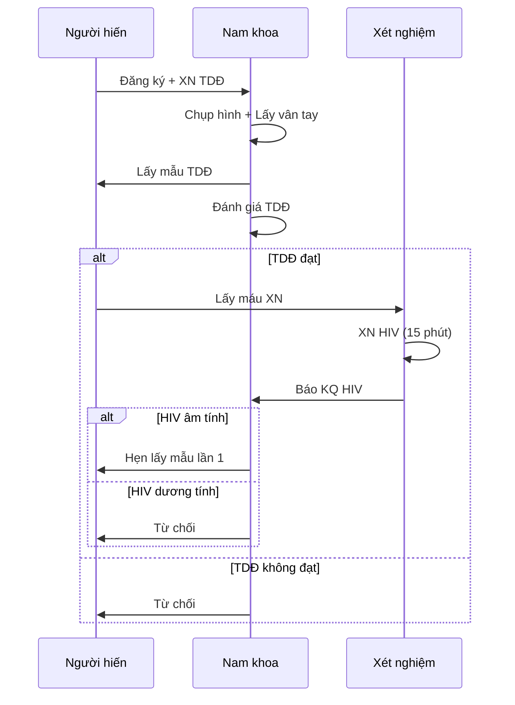

# IVF System - Workflow Details

## Overview

Detailed breakdown of all 26 workflows with step-by-step implementation guidance.

---

## PHẦN 1: WORKFLOWS BỆNH NHÂN HIẾM MUỘN

### Workflow IVFMD.01: Khám và tư vấn hiếm muộn lần đầu

**Trigger:** Bệnh nhân đến phòng khám lần đầu tiên

**Departments:** Quầy STT → Tiếp đón + Thu ngân → NHS Hành chánh → BS Siêu âm → BS Tư vấn → Xét nghiệm → Nam khoa



**System Actions:**
1. Auto-generate patient code (BN-YYYY-XXXXXX)
2. Create queue tickets (SA, TV, XN)
3. Create invoice with services
4. Print registration form ("Phiếu khám hiếm muộn")
5. Record ultrasound results
6. Track test orders

**Database Records:**
- `patients` (new record)
- `queue_tickets` (multiple: SA, TV, XN)
- `invoices` + `invoice_items`
- `ultrasounds` (if SA performed)

---

### Workflow IVFMD.02: Tư vấn sau KQ XN thường qui

**Trigger:** BN quay lại sau 1 ngày để lấy KQ XN

**Key Decision Points:**
- Hướng điều trị: KTBT+QHTN / IUI / ICSI / IVM
- Ngày khám: N2 hoặc N3 VK?
- IVF → Cần XN tiền mê + ECG



**System Actions:**
1. Lookup patient by appointment
2. Retrieve lab results
3. Create treatment cycle record
4. Generate prescription
5. Schedule follow-up appointments
6. Order pre-anesthesia tests (if IVF)

---

### Workflow IVFMD.10: Tái khám theo dõi KTBT - IVF

**Trigger:** 4-5 ngày sau tiêm thuốc KTBT

**Cycle:** Lặp lại 10-12 ngày



**API Endpoints Used:**
- `POST /api/cycles/{id}/ultrasound`
- `POST /api/prescriptions`
- `PUT /api/cycles/{id}/phase`

**Key Data Captured:**
- Follicle counts (L/R)
- Follicle sizes (individual)
- Endometrium thickness
- E2, P4, LH hormone levels

---

### Workflow IVFMD.11: Chỉ định tiêm thuốc rụng trứng - IVF

**Trigger:** Nang noãn đạt kích thước (≥18mm)

**Critical Timing:** 36 giờ trước chọc hút

```json
// Trigger Shot Record
{
  "cycleId": "uuid",
  "triggerType": "hCG",
  "drug": "Ovitrelle 250mcg",
  "injectionTime": "2026-02-03T22:00:00Z",
  "scheduledRetrievalTime": "2026-02-05T10:00:00Z"
}
```

**System Alerts:**
- SMS/Notification to patient with injection time
- Auto-schedule egg retrieval appointment
- Send reminder 2 hours before injection

---

### Workflow IVFMD.30: Chọc hút (Egg Retrieval)

**Trigger:** 36 giờ sau tiêm thuốc rụng trứng

**Departments:** TD → HC → Nam khoa + Gây mê → BS Hiếm muộn → LABO

**Procedure Steps:**
1. Patient check-in & payment (Chọc hút + Chuyển phôi fee)
2. Husband provides sperm sample
3. IV line placement
4. Anesthesia
5. Egg retrieval procedure
6. Post-procedure monitoring
7. Discharge with medication

**Critical Data:**
```json
{
  "cycleId": "uuid",
  "retrievalDate": "2026-02-05T10:30:00Z",
  "eggsRetrieved": 12,
  "matureEggs": 10,
  "anesthesiaType": "IV Sedation",
  "doctor": "Dr. Nguyen",
  "complications": null
}
```

**Lab Handoff:**
- Eggs transferred to LABO
- Sperm sample received
- ICSI/IVF procedure scheduled

---

### Workflow IVFMD.40: IUI Procedure

**Trigger:** 36 giờ sau tiêm thuốc rụng trứng

**Simpler Flow (vs Chọc hút):**
1. Husband provides sample (2 hours before)
2. Sperm washing by Nam khoa
3. IUI procedure (no anesthesia)
4. Rest 15-30 minutes
5. Discharge with luteal support medication

```json
{
  "cycleId": "uuid",
  "iuiDate": "2026-02-05T10:00:00Z",
  "spermCountPreWash": 50000000,
  "spermCountPostWash": 20000000,
  "motilityPostWash": 85,
  "catheterUsed": "Cook Soft",
  "doctor": "Dr. Tran"
}
```

---

### Workflow IVFMD.80: Báo phôi + Chuyển phôi + Trữ phôi

**Trigger:** Ngày 3, 5, hoặc 6 sau chọc hút

**Decision Tree:**


**Embryo Report Structure:**
```json
{
  "cycleId": "uuid",
  "reportDate": "2026-02-08",
  "embryos": [
    {"number": 1, "grade": "AA", "day": "D5", "status": "Transferred"},
    {"number": 2, "grade": "AB", "day": "D5", "status": "Frozen"},
    {"number": 3, "grade": "BB", "day": "D5", "status": "Frozen"},
    {"number": 4, "grade": "CC", "day": "D5", "status": "Discarded"}
  ],
  "transferred": 1,
  "frozen": 2,
  "discarded": 1
}
```

**Freeze Pricing Logic:**
- First top (1-2 embryos D5/D6, or 1-3 D3): 8,000,000 VND
- Each additional top: 2,000,000 VND
- Special embryos: 1 per top (1 embryo = 8M)

---

### Workflow IVFMD.90: Thử thai (Beta HCG)

**Trigger:** 14 ngày sau chuyển phôi hoặc IUI

**Important Rule:** Only doctor can inform patient of result



---

## PHẦN 2: WORKFLOWS NGÂN HÀNG TINH TRÙNG (NHTT)

### Workflow IVFMD.N4: Kiểm tra tiêu chuẩn nhận vào NHTT

**Screening Criteria:**
- Semen analysis normal
- HIV, HBsAg, HCV, BW, Blood type: Negative/Normal
- Age: 20-45



### Workflow IVFMD.N5-N6: Lấy mẫu lần 1 & 2

**Process:**
1. Verify identity (photo + fingerprint)
2. Collect sample
3. LABO processes & freezes
4. After sample 2: Schedule HIV retest (3 months later)

### Workflow IVFMD.N7: Sử dụng mẫu NHTT

**Matching Rules:**
- 1 donor → max 2 couples
- Sample discarded after:
  - Wife pregnant & baby healthy at 1 year
  - 1 year since last sample used

---

## PHẦN 3: WORKFLOWS PHỤ TRỢ

### IVFMD.D1: Quản lý thuốc bù tủ trực

For anesthesia drugs used during procedures.

### IVFMD.D2-D3: Vật tư tiêu hao

Track consumables used (needles, catheters, etc.)

---

## UI Screen Specifications

### Reception Dashboard

| Section | Components |
|---------|------------|
| Patient Search | Search box, recent patients list |
| Registration | Multi-step form with photo capture |
| Queue | Issue ticket buttons by type |
| Payment | Invoice creation, payment recording |
| Display | Real-time queue board |

### Ultrasound Screen

| Section | Components |
|---------|------------|
| Patient Info | Name, cycle info, last visit |
| Follicle Entry | Left/Right ovary grids with size inputs |
| Endometrium | Thickness input with diagram |
| Summary | Auto-calculated totals |
| Actions | Save, Print, Next patient |

### Lab Dashboard

| Section | Components |
|---------|------------|
| Daily Cases | List of today's retrievals |
| Embryo Board | Kanban-style tracking (D1→D6) |
| Cryo Inventory | Tank visualization |
| Reports | Daily embryo report generation |

---

## Integration Points

| System | Integration Type | Data Exchange |
|--------|------------------|---------------|
| Hospital HIS | REST API | Patient demographics |
| LIS | HL7/REST | Lab results |
| Pharmacy | REST API | Prescriptions |
| SMS Gateway | REST API | Appointment reminders |
| Payment Gateway | REST API | Card payments |


## Auto-Phase-Advance for the entire IVF lifecycle. Now, whenever you fill out data and click Save, the system intelligently moves the cycle forward:

- Stimulation (OvarianStimulation) → Saves AspirationDate → Moves to Egg Retrieval (Chọc hút).
- Stimulation (OvarianStimulation) → Saves HcgDate → Moves to Trigger Shot.
- Culture (EmbryoCulture) → Saves TotalFreezedEmbryo → Moves to Embryo Culture.
- Transfer (EmbryoTransfer) → Saves TransferDate → Moves to Embryo Transfer.
- Luteal (LutealSupport) → Saves Drugs → Moves to Luteal Support.
- Pregnancy (PregnancyTest) → Saves BetaHcg → Moves to Pregnancy Test.